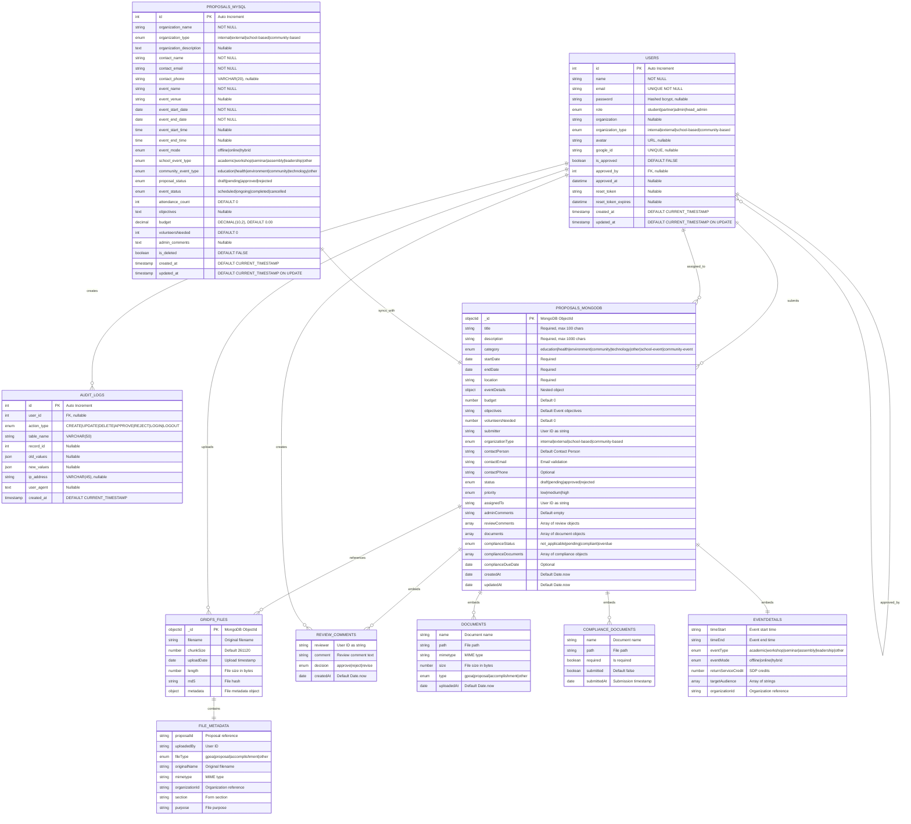

# CEDO Event Management System - ERD & Database Architecture

## Overview
This document provides a comprehensive Entity-Relationship Diagram (ERD) and database architecture for the CEDO Event Management System, based on actual codebase analysis. The system implements a **hybrid database architecture** using both MySQL for relational data and MongoDB for document-based data storage.

## Visual ERD Diagram

The complete ERD diagram showing all entities and relationships is available as a Mermaid diagram. The diagram illustrates:

- **MySQL Tables**: Users, Proposals (simplified), Audit Logs
- **MongoDB Collections**: Proposals (complex documents), GridFS Files
- **Cross-Database Relationships**: Logical connections between MySQL and MongoDB
- **Embedded Documents**: MongoDB nested structures

*Note: The visual ERD diagram can be rendered using any Mermaid-compatible tool or viewer.*

## Application Flow Diagram

Based on the actual frontend and backend code analysis, here's the comprehensive application workflow diagram showing the real implementation flows:

### Mermaid FlowChart Code

```mermaid
flowchart TD
    %% ========================================
    %% USER ENTRY POINTS
    %% ========================================
    
    Start([🚀 User Visits CEDO System]) --> AuthCheck{🔐 User Authenticated?}
    
    %% ========================================
    %% AUTHENTICATION FLOWS
    %% ========================================
    
    AuthCheck -->|No| SignInPage[📱 Sign-In Page<br/>frontend/src/app/auth/sign-in]
    
    SignInPage --> AuthMethod{Choose Auth Method}
    
    %% Email/Password Flow
    AuthMethod -->|Email + Password| EmailForm[📝 Email/Password Form]
    EmailForm --> RecaptchaVerify[🤖 reCAPTCHA Verification]
    RecaptchaVerify --> EmailAuth[🔍 POST /api/auth/login<br/>backend/routes/auth.js]
    EmailAuth --> CredentialsCheck{Valid Credentials?}
    CredentialsCheck -->|No| AuthError[❌ Invalid Credentials Error]
    AuthError --> SignInPage
    CredentialsCheck -->|Yes| ApprovalCheck{User Approved?}
    
    %% Google OAuth Flow
    AuthMethod -->|Google Sign-In| GoogleButton[🔘 Google OAuth Button]
    GoogleButton --> GoogleAuth[🌐 Google Authentication]
    GoogleAuth --> GoogleVerify[✅ POST /api/auth/google<br/>backend/routes/auth.js]
    GoogleVerify --> GoogleUserCheck{User Exists?}
    GoogleUserCheck -->|No| CreateGoogleUser[👤 Create New User<br/>MySQL users table]
    CreateGoogleUser --> ApprovalCheck
    GoogleUserCheck -->|Yes| ApprovalCheck
    
    %% Approval Status Check
    ApprovalCheck -->|Not Approved| PendingError[⏳ Account Pending Approval]
    PendingError --> SignInPage
    ApprovalCheck -->|Approved| GenerateToken[🎫 Generate JWT Token<br/>sessionManager.generateToken]
    GenerateToken --> RoleBasedRedirect{User Role?}
    
    %% ========================================
    %% ROLE-BASED ROUTING
    %% ========================================
    
    AuthCheck -->|Yes| RoleBasedRedirect
    
    RoleBasedRedirect -->|Student/Partner| StudentDashboard[👨‍🎓 Student Dashboard<br/>frontend/src/app/main/student-dashboard]
    RoleBasedRedirect -->|Admin/Head Admin| AdminDashboard[👨‍💼 Admin Dashboard<br/>frontend/src/app/main/admin-dashboard]
    
    %% ========================================
    %% STUDENT PROPOSAL FLOW
    %% ========================================
    
    StudentDashboard --> StudentAction{Student Action}
    
    StudentAction -->|Submit Event| ProposalFlow[📋 Submit Event Flow<br/>SubmitEventFlow.jsx]
    ProposalFlow --> LoadFormData[💾 Load Form Data<br/>autoSaveConfig.loadFormData]
    LoadFormData --> FormDataCheck{Has Saved Data?}
    FormDataCheck -->|Yes| RestoreDialog[🔄 Restore Form Data Dialog]
    FormDataCheck -->|No| Section1[📝 Section 1: Overview<br/>Section1_Overview]
    RestoreDialog --> CurrentSection{Current Section?}
    
    %% Multi-Step Form Flow
    Section1 --> ValidateS1{Validation OK?}
    ValidateS1 -->|No| ValidationError1[❌ Show Validation Errors]
    ValidationError1 --> Section1
    ValidateS1 -->|Yes| AutoSave1[💾 Auto-Save Data<br/>localStorage]
    AutoSave1 --> Section2[🏢 Section 2: Organization<br/>Section2_OrgInfo]
    
    Section2 --> ValidateS2{Validation OK?}
    ValidateS2 -->|No| ValidationError2[❌ Show Validation Errors]
    ValidationError2 --> Section2
    ValidateS2 -->|Yes| SaveOrgData[💾 POST /api/proposals/section2<br/>MySQL proposals table]
    SaveOrgData --> AutoSave2[💾 Auto-Save Data]
    AutoSave2 --> EventType[🎯 Event Type Selection<br/>EventTypeSelection]
    
    EventType --> EventTypeChoice{Event Type?}
    EventTypeChoice -->|School Event| Section3School[🏫 Section 3: School Event<br/>Section3_SchoolEvent]
    EventTypeChoice -->|Community Event| Section4Community[🌍 Section 4: Community Event<br/>Section4_CommunityEvent]
    
    %% School Event Flow
    Section3School --> ValidateS3{Validation OK?}
    ValidateS3 -->|No| ValidationError3[❌ Show Validation Errors]
    ValidationError3 --> Section3School
    ValidateS3 -->|Yes| SaveEventData[💾 POST /api/proposals/section3<br/>MySQL proposals table]
    SaveEventData --> FileUploadCheck{Has Files?}
    
    %% Community Event Flow
    Section4Community --> ValidateS4{Validation OK?}
    ValidateS4 -->|No| ValidationError4[❌ Show Validation Errors]
    ValidationError4 --> Section4Community
    ValidateS4 -->|Yes| SaveCommunityData[💾 POST /api/proposals/section4<br/>MongoDB proposals collection]
    SaveCommunityData --> FileUploadCheck
    
    %% File Upload Flow
    FileUploadCheck -->|Yes| FileUpload[📎 File Upload Process<br/>HybridFileService]
    FileUpload --> FileStorage{File Size?}
    FileStorage -->|Large Files| GridFSStorage[🗄️ MongoDB GridFS Storage<br/>gridfs_files collection]
    FileStorage -->|Small Files| FilesystemStorage[📁 Filesystem Storage<br/>backend/uploads]
    GridFSStorage --> FileMetadata[📋 Store File Metadata<br/>MongoDB metadata]
    FilesystemStorage --> FileMetadata
    FileMetadata --> Section5
    FileUploadCheck -->|No| Section5[📊 Section 5: Reporting<br/>Section5_Reporting]
    
    %% Final Submission
    Section5 --> ValidateS5{Validation OK?}
    ValidateS5 -->|No| ValidationError5[❌ Show Validation Errors]
    ValidationError5 --> Section5
    ValidateS5 -->|Yes| SubmissionDialog[✅ Submit Proposal Dialog]
    SubmissionDialog --> FinalSubmit[🚀 Final Submission<br/>Update status to 'pending']
    FinalSubmit --> NotifyAdmin[📧 Notify Admin<br/>Email/System Notification]
    NotifyAdmin --> SuccessDialog[🎉 Success Dialog<br/>Submission Complete]
    SuccessDialog --> StudentDashboard
    
    %% ========================================
    %% ADMIN WORKFLOW
    %% ========================================
    
    AdminDashboard --> AdminAction{Admin Action}
    
    AdminAction -->|View Proposals| ProposalsList[📋 GET /api/admin/proposals<br/>adminService.getAdminProposals]
    ProposalsList --> HybridData[🔄 Merge MySQL + MongoDB Data<br/>Hybrid Data Integration]
    HybridData --> AdminProposalView[📄 Admin Proposal View<br/>proposal-table.jsx]
    
    AdminProposalView --> ReviewAction{Review Action}
    
    %% Proposal Review Flow
    ReviewAction -->|Review| ProposalDetails[🔍 View Proposal Details<br/>ProposalDetailsModal.jsx]
    ProposalDetails --> ReviewDecision{Admin Decision}
    
    ReviewDecision -->|Approve| ApproveProposal[✅ Approve Proposal<br/>Update proposal_status]
    ApproveProposal --> LogApproval[📝 Log Action<br/>audit_logs table]
    LogApproval --> NotifyStudent1[📧 Notify Student - Approved]
    NotifyStudent1 --> AdminDashboard
    
    ReviewDecision -->|Reject| RejectDialog[❌ Rejection Dialog<br/>Add Comments]
    RejectDialog --> RejectProposal[❌ Reject Proposal<br/>Update proposal_status]
    RejectProposal --> LogRejection[📝 Log Action<br/>audit_logs table]
    LogRejection --> NotifyStudent2[📧 Notify Student - Rejected]
    NotifyStudent2 --> AdminDashboard
    
    ReviewDecision -->|Request Revision| RevisionDialog[🔄 Request Revision Dialog<br/>Add Comments]
    RevisionDialog --> RequestRevision[🔄 Request Revision<br/>Update proposal_status]
    RequestRevision --> LogRevision[📝 Log Action<br/>audit_logs table]
    LogRevision --> NotifyStudent3[📧 Notify Student - Revision Needed]
    NotifyStudent3 --> AdminDashboard
    
    %% User Management Flow
    AdminAction -->|Manage Users| UsersList[👥 GET /api/admin/users<br/>MySQL users table]
    UsersList --> UserManagement[👤 User Management<br/>approve/reject accounts]
    UserManagement --> UserAction{User Action}
    
    UserAction -->|Approve User| ApproveUser[✅ Approve User Account<br/>Update is_approved = true]
    ApproveUser --> LogUserApproval[📝 Log Action<br/>audit_logs table]
    LogUserApproval --> EmailWelcome[📧 Send Welcome Email]
    EmailWelcome --> AdminDashboard
    
    UserAction -->|Reject User| RejectUser[❌ Reject User Account<br/>Delete or mark rejected]
    RejectUser --> LogUserRejection[📝 Log Action<br/>audit_logs table]
    LogUserRejection --> EmailRejection[📧 Send Rejection Email]
    EmailRejection --> AdminDashboard
    
    %% Statistics and Reports
    AdminAction -->|View Stats| AdminStats[📊 GET /api/admin/stats<br/>adminService.getAdminStats]
    AdminStats --> StatsCalculation[🧮 Calculate Statistics<br/>MySQL aggregations]
    StatsCalculation --> StatsDisplay[📈 Display Dashboard Stats<br/>Charts and metrics]
    StatsDisplay --> AdminDashboard
    
    %% ========================================
    %% CURRENT SECTION ROUTING
    %% ========================================
    
    CurrentSection -->|overview| Section1
    CurrentSection -->|organization| Section2
    CurrentSection -->|schoolEvent| Section3School
    CurrentSection -->|communityEvent| Section4Community
    CurrentSection -->|reporting| Section5
    
    %% ========================================
    %% ERROR HANDLING & NAVIGATION
    %% ========================================
    
    StudentAction -->|View Profile| ProfilePage[👤 User Profile<br/>GET /api/user]
    StudentAction -->|View My Proposals| MyProposals[📋 My Proposals<br/>Filter by user ID]
    StudentAction -->|View Events| EventsPage[🎪 Events Page<br/>View upcoming events]
    
    %% Logout Flow
    StudentDashboard --> LogoutAction[🚪 Logout]
    AdminDashboard --> LogoutAction
    LogoutAction --> ClearToken[🗑️ Clear JWT Token<br/>Remove from localStorage]
    ClearToken --> ClearSession[🧹 Clear Session Data<br/>sessionManager.clearSession]
    ClearSession --> Start
    
    %% ========================================
    %% STYLING CLASSES
    %% ========================================
    
    classDef startEnd fill:#e1f5fe,stroke:#01579b,stroke-width:3px,color:#000
    classDef process fill:#f3e5f5,stroke:#4a148c,stroke-width:2px,color:#000
    classDef decision fill:#fff3e0,stroke:#e65100,stroke-width:2px,color:#000
    classDef database fill:#e8f5e8,stroke:#2e7d32,stroke-width:2px,color:#000
    classDef error fill:#ffebee,stroke:#c62828,stroke-width:2px,color:#000
    classDef auth fill:#f1f8e9,stroke:#33691e,stroke-width:2px,color:#000
    classDef admin fill:#fce4ec,stroke:#880e4f,stroke-width:2px,color:#000
    
    %% Apply styles
    class Start,SuccessDialog startEnd
    class EmailForm,GoogleButton,ProposalFlow,Section1,Section2,Section3School,Section4Community,Section5 process
    class AuthCheck,CredentialsCheck,ApprovalCheck,RoleBasedRedirect,StudentAction,AdminAction decision
    class SaveOrgData,SaveEventData,GridFSStorage,FilesystemStorage,ProposalsList,UsersList database
    class AuthError,PendingError,ValidationError1,ValidationError2,ValidationError3,ValidationError4,ValidationError5 error
    class EmailAuth,GoogleAuth,GenerateToken,RecaptchaVerify auth
    class AdminDashboard,AdminProposalView,ProposalDetails,ApproveProposal,RejectProposal admin
```



### FlowChart Features

This comprehensive application flowchart includes:

1. **Authentication Flows**:
   - Email/password login with reCAPTCHA verification
   - Google OAuth integration
   - JWT token generation and session management
   - Role-based dashboard routing

2. **Multi-Step Proposal Submission**:
   - Auto-save functionality with localStorage
   - Form validation at each step
   - Hybrid database storage (MySQL + MongoDB)
   - File upload with GridFS integration
   - State machine-driven navigation

3. **Admin Workflow**:
   - Proposal review and approval process
   - User account management
   - Statistics dashboard
   - Audit logging for all actions

4. **Database Operations**:
   - Hybrid MySQL/MongoDB data storage
   - File storage via GridFS and filesystem
   - Cross-database data merging
   - Transaction logging

5. **Real Implementation Details**:
   - Actual component names from frontend code
   - Specific API endpoints from backend routes
   - Database table and collection names
   - Service class methods and functions

### Code Integration References

This flowchart is based on analysis of actual code files:

- **Frontend Components**: Based on [Mermaid.js documentation](https://mermaid.js.org/intro/getting-started.html) and [flowchart syntax](https://mermaid.js.org/syntax/flowchart.html)
- **Authentication**: `frontend/src/app/(auth)/sign-in/page.jsx`, `backend/routes/auth.js`
- **Proposal Flow**: `frontend/src/app/(main)/student-dashboard/submit-event/SubmitEventFlow.jsx`
- **Admin Dashboard**: `backend/routes/admin.js`, `frontend/src/app/(main)/admin-dashboard/`
- **Database Models**: `backend/models/User.js`, `backend/models/Proposal.js`
- **Services**: `backend/services/admin.service.js`, `backend/services/proposal.service.js`

### Usage Instructions

1. **Copy the flowchart code** above
2. **Paste into Mermaid-compatible tools**:
   - [Mermaid Live Editor](https://mermaid.live/) as shown in [Dom PL's Medium article](https://dompl.medium.com/produce-great-looking-flowcharts-in-seconds-7f3bea64f2e2)
   - GitHub markdown files
   - VS Code with Mermaid extension
   - Documentation platforms supporting Mermaid

3. **Customize styling** by modifying the `classDef` definitions at the bottom

This flowchart provides a comprehensive view of how your CEDO Event Management System actually works, showing the real implementation flows from user authentication through proposal submission to admin approval processes.

### Mermaid ERD Diagram Code



### Diagram Features

This comprehensive ERD diagram includes:

1. **Color-coded Entities**: 
   - MySQL tables (Users, Proposals_MySQL, Audit_Logs)
   - MongoDB collections (Proposals_MongoDB, GridFS_Files)
   - Embedded documents (Review_Comments, Documents, etc.)

2. **Detailed Attributes**:
   - Primary keys (PK) and foreign keys (FK)
   - Data types and constraints
   - Default values and nullable fields
   - Enum value specifications

3. **Relationship Types**:
   - One-to-Many (||--o{)
   - One-to-One (||--||)
   - Self-referential relationships
   - Cross-database logical relationships

4. **Hybrid Architecture**:
   - Clear separation between MySQL and MongoDB entities
   - Cross-database synchronization relationships
   - Embedded document structures in MongoDB

5. **File Storage Integration**:
   - GridFS file storage relationships
   - File metadata connections
   - User file upload relationships

### Usage Instructions

To render this diagram:

1. **Copy the Mermaid code** from the code block above
2. **Paste it into any Mermaid-compatible tool**:
   - [Mermaid Live Editor](https://mermaid.live/)
   - [Mermaid Chart](https://mermaid.ink/)
   - GitHub (in markdown files)
   - VS Code with Mermaid extension
   - Documentation platforms supporting Mermaid

3. **Customize as needed** for your specific use case

### Integration with EventCatalog

As mentioned in the [EventCatalog documentation](https://www.eventcatalog.dev/docs/development/components/mermaid), this diagram can be embedded directly in EventCatalog documentation for comprehensive system documentation.

## Database Architecture Summary

### Hybrid Database Design
- **MySQL Database**: `cedo_auth` - Stores user accounts, authentication data, and simplified proposal metadata
- **MongoDB Database**: `cedo_auth` - Stores complex proposal documents, file metadata, and nested structures
- **Integration**: Hybrid services merge data from both databases using common identifiers

### Key Design Decisions
1. **User Management**: Centralized in MySQL for ACID compliance and relational integrity
2. **Proposal Metadata**: Simplified structure in MySQL for fast queries and reporting
3. **Proposal Documents**: Complex nested structure in MongoDB for flexibility
4. **File Storage**: Hybrid approach using GridFS for large files and filesystem for small files
5. **Cross-Database Sync**: Services layer handles data integration and consistency

### Connection Configuration
- **MySQL**: Connection pooling with up to 50 connections (production)
- **MongoDB**: MongoClient with authentication via `cedo_admin` user
- **File Storage**: Hybrid approach using both MongoDB GridFS and filesystem storage

## MySQL Database Schema

### Users Table
```sql
CREATE TABLE users (
    id INT PRIMARY KEY AUTO_INCREMENT,
    name VARCHAR(255) NOT NULL,
    email VARCHAR(255) UNIQUE NOT NULL,
    password VARCHAR(255), -- Hashed with bcrypt (nullable for Google OAuth)
    role ENUM('student', 'partner', 'admin', 'head_admin') DEFAULT 'partner',
    organization VARCHAR(255),
    organization_type ENUM('internal', 'external', 'school-based', 'community-based'),
    avatar VARCHAR(255), -- URL to avatar image
    google_id VARCHAR(255) UNIQUE, -- Google OAuth identifier
    is_approved BOOLEAN DEFAULT FALSE,
    approved_by INT, -- Foreign key to users.id
    approved_at DATETIME,
    reset_token VARCHAR(255), -- For password reset
    reset_token_expires DATETIME,
    created_at TIMESTAMP DEFAULT CURRENT_TIMESTAMP,
    updated_at TIMESTAMP DEFAULT CURRENT_TIMESTAMP ON UPDATE CURRENT_TIMESTAMP,
    
    -- Indexes
    INDEX idx_email (email),
    INDEX idx_google_id (google_id),
    INDEX idx_role (role),
    INDEX idx_is_approved (is_approved),
    
    -- Foreign Keys
    FOREIGN KEY (approved_by) REFERENCES users(id) ON DELETE SET NULL
);
```

### Proposals Table (MySQL - Simplified Metadata)
```sql
CREATE TABLE proposals (
    id INT PRIMARY KEY AUTO_INCREMENT,
    
    -- Organization Information
    organization_name VARCHAR(255) NOT NULL,
    organization_type ENUM('internal', 'external', 'school-based', 'community-based') NOT NULL,
    organization_description TEXT,
    
    -- Contact Information
    contact_name VARCHAR(255) NOT NULL,
    contact_email VARCHAR(255) NOT NULL,
    contact_phone VARCHAR(20),
    
    -- Event Information
    event_name VARCHAR(255) NOT NULL,
    event_venue VARCHAR(255),
    event_start_date DATE NOT NULL,
    event_end_date DATE NOT NULL,
    event_start_time TIME,
    event_end_time TIME,
    event_mode ENUM('offline', 'online', 'hybrid') DEFAULT 'offline',
    
    -- Event Types
    school_event_type ENUM('academic', 'workshop', 'seminar', 'assembly', 'leadership', 'other'),
    community_event_type ENUM('education', 'health', 'environment', 'community', 'technology', 'other'),
    
    -- Status Management
    proposal_status ENUM('draft', 'pending', 'approved', 'rejected') DEFAULT 'pending',
    event_status ENUM('scheduled', 'ongoing', 'completed', 'cancelled') DEFAULT 'scheduled',
    
    -- Additional Information
    attendance_count INT DEFAULT 0,
    objectives TEXT,
    budget DECIMAL(10,2) DEFAULT 0.00,
    volunteersNeeded INT DEFAULT 0,
    admin_comments TEXT,
    
    -- Meta Information
    is_deleted BOOLEAN DEFAULT FALSE,
    created_at TIMESTAMP DEFAULT CURRENT_TIMESTAMP,
    updated_at TIMESTAMP DEFAULT CURRENT_TIMESTAMP ON UPDATE CURRENT_TIMESTAMP,
    
    -- Indexes
    INDEX idx_organization_name (organization_name),
    INDEX idx_contact_email (contact_email),
    INDEX idx_proposal_status (proposal_status),
    INDEX idx_event_status (event_status),
    INDEX idx_organization_type (organization_type),
    INDEX idx_event_dates (event_start_date, event_end_date),
    INDEX idx_is_deleted (is_deleted),
    
    -- Composite Indexes for Common Queries
    INDEX idx_status_type (proposal_status, organization_type),
    INDEX idx_active_proposals (is_deleted, proposal_status, created_at)
);
```

### Audit Log Table (Implied from Service Logic)
```sql
CREATE TABLE audit_logs (
    id INT PRIMARY KEY AUTO_INCREMENT,
    user_id INT,
    action_type ENUM('CREATE', 'UPDATE', 'DELETE', 'APPROVE', 'REJECT', 'LOGIN', 'LOGOUT'),
    table_name VARCHAR(50),
    record_id INT,
    old_values JSON,
    new_values JSON,
    ip_address VARCHAR(45),
    user_agent TEXT,
    created_at TIMESTAMP DEFAULT CURRENT_TIMESTAMP,
    
    -- Indexes
    INDEX idx_user_id (user_id),
    INDEX idx_action_type (action_type),
    INDEX idx_table_record (table_name, record_id),
    INDEX idx_created_at (created_at),
    
    -- Foreign Keys
    FOREIGN KEY (user_id) REFERENCES users(id) ON DELETE SET NULL
);
```

## MongoDB Database Schema

### Proposals Collection (MongoDB - Complex Documents)
```javascript
{
    _id: ObjectId("..."),
    
    // Basic Information
    title: String, // Required, max 100 chars
    description: String, // Required, max 1000 chars
    category: String, // enum: ["education", "health", "environment", "community", "technology", "other", "school-event", "community-event"]
    
    // Date and Location
    startDate: Date, // Required
    endDate: Date, // Required
    location: String, // Required
    
    // Event Details
    eventDetails: {
        timeStart: String,
        timeEnd: String,
        eventType: String, // enum: ["academic", "workshop", "seminar", "assembly", "leadership", "other"]
        eventMode: String, // enum: ["offline", "online", "hybrid"]
        returnServiceCredit: Number,
        targetAudience: [String],
        organizationId: String
    },
    
    // Financial and Resources
    budget: Number, // Default: 0
    objectives: String, // Default: 'Event objectives'
    volunteersNeeded: Number, // Default: 0
    
    // Submitter Information
    submitter: String, // User ID as string
    organizationType: String, // enum: ["internal", "external", "school-based", "community-based"]
    
    // Contact Information
    contactPerson: String, // Default: 'Contact Person'
    contactEmail: String, // Email validation, Default: 'contact@example.com'
    contactPhone: String,
    
    // Status Management
    status: String, // enum: ["draft", "pending", "approved", "rejected"], Default: "pending"
    priority: String, // enum: ["low", "medium", "high"], Default: "medium"
    assignedTo: String, // User ID as string
    
    // Review and Comments
    adminComments: String, // Default: ''
    reviewComments: [
        {
            reviewer: String, // User ID as string
            comment: String,
            decision: String, // enum: ["approve", "reject", "revise"]
            createdAt: Date // Default: Date.now
        }
    ],
    
    // File Management
    documents: [
        {
            name: String,
            path: String,
            mimetype: String,
            size: Number,
            type: String, // enum: ["gpoa", "proposal", "accomplishment", "other"]
            uploadedAt: Date // Default: Date.now
        }
    ],
    
    // Compliance Management
    complianceStatus: String, // enum: ["not_applicable", "pending", "compliant", "overdue"], Default: "not_applicable"
    complianceDocuments: [
        {
            name: String,
            path: String,
            required: Boolean,
            submitted: Boolean, // Default: false
            submittedAt: Date
        }
    ],
    complianceDueDate: Date,
    
    // Timestamps
    createdAt: Date, // Default: Date.now
    updatedAt: Date  // Default: Date.now, Updated on findOneAndUpdate
}
```

### GridFS Files Collection (MongoDB - File Storage)
```javascript
// GridFS Bucket: 'uploads'
{
    _id: ObjectId("..."),
    filename: String,
    chunkSize: Number,
    uploadDate: Date,
    length: Number,
    md5: String,
    metadata: {
        proposalId: String,
        uploadedBy: String, // User ID
        fileType: String, // enum: ["gpoa", "proposal", "accomplishment", "other"]
        originalName: String,
        mimetype: String,
        organizationId: String,
        section: String, // Which form section uploaded this
        purpose: String
    }
}
```

## ERD Relationships

### MySQL Relationships
1. **Users Self-Referential**: `users.approved_by` → `users.id` (One-to-Many)
2. **Audit Logs**: `audit_logs.user_id` → `users.id` (Many-to-One)
3. **Proposals-Users**: Implicit relationship through application logic (not FK enforced)

### MongoDB Relationships (Document References)
1. **Proposals-Users**: `proposals.submitter` → `users.id` (as string)
2. **Proposals-Users**: `proposals.assignedTo` → `users.id` (as string)
3. **Review Comments**: `proposals.reviewComments[].reviewer` → `users.id` (as string)
4. **GridFS-Proposals**: `fs.files.metadata.proposalId` → `proposals._id` (as string)

### Cross-Database Relationships
1. **Hybrid Proposals**: `mysql.proposals.id` ↔ `mongodb.proposals.organizationId` (String conversion)
2. **File Integration**: Services merge file data from MongoDB into MySQL proposal responses

## Data Flow Architecture

### Create User Flow
```
1. Frontend Registration Form
2. POST /api/auth/register
3. User.create() → MySQL users table
4. Password hashing with bcrypt
5. Email verification (optional)
6. Admin approval required (is_approved = false)
```

### Proposal Submission Flow
```
1. Multi-step Frontend Form
2. Section 2: POST /api/proposals/section2 → MySQL proposals table
3. Section 3: POST /api/proposals/section3 → MySQL proposals table
4. File Upload: POST /api/mongodb-unified/proposals → MongoDB + GridFS
5. Submit: Update proposal_status to 'pending'
6. Admin notification
```

### File Storage Flow
```
1. Frontend File Upload
2. Multer middleware processes files
3. HybridFileService determines storage location
4. GridFS storage for large files
5. Filesystem storage for small files
6. Metadata stored in MongoDB
7. File references merged into MySQL responses
```

## Performance Optimizations

### MySQL Optimizations
- **Connection Pooling**: Up to 50 connections in production
- **Indexes**: Composite indexes for common query patterns
- **Query Optimization**: Prepared statements and parameterized queries
- **Charset**: UTF8MB4 for full Unicode support

### MongoDB Optimizations
- **Connection Management**: Cached client connections
- **Retry Logic**: Exponential backoff for connection failures
- **Aggregation**: Efficient document queries
- **GridFS**: Automatic chunking for large files

## Security Considerations

### Authentication
- **Password Hashing**: bcrypt with salt rounds
- **JWT Tokens**: Stateless authentication
- **Google OAuth**: Third-party authentication integration
- **Session Management**: Secure cookie handling

### Data Protection
- **Role-Based Access Control**: User, Admin, Head Admin roles
- **Input Validation**: Express-validator middleware
- **SQL Injection Prevention**: Parameterized queries
- **NoSQL Injection Prevention**: Mongoose schema validation

### File Security
- **File Type Validation**: MIME type checking
- **File Size Limits**: Configurable upload limits
- **Path Traversal Prevention**: Sanitized file paths
- **Virus Scanning**: Integration ready for antivirus services

## Database Maintenance

### Backup Strategy
- **MySQL**: Regular mysqldump with incremental backups
- **MongoDB**: mongodump with consistent snapshots
- **GridFS**: Separate backup of file chunks and metadata
- **Cross-Database Consistency**: Coordinated backup timing

### Monitoring
- **Connection Health**: Automated connection testing
- **Query Performance**: Slow query logging
- **Storage Usage**: Disk space monitoring
- **Error Tracking**: Comprehensive error logging

## Migration Considerations

### Data Synchronization
- **Hybrid Services**: Merge data from both databases
- **Consistency Checks**: Validate data integrity between systems
- **Conflict Resolution**: Handle ID mismatches and data conflicts
- **Rollback Procedures**: Safe migration rollback strategies

## Quick Reference

### Entity Summary
| Entity | Database | Primary Key | Purpose |
|--------|----------|-------------|---------|
| Users | MySQL | `id` (INT) | User accounts and authentication |
| Proposals (Meta) | MySQL | `id` (INT) | Simplified proposal metadata |
| Audit Logs | MySQL | `id` (INT) | System activity tracking |
| Proposals (Full) | MongoDB | `_id` (ObjectId) | Complex proposal documents |
| GridFS Files | MongoDB | `_id` (ObjectId) | File storage and metadata |

### Key Relationships
- **Users → Proposals**: One-to-Many (via submitter field)
- **Users → Users**: Self-referential (approval hierarchy)
- **Proposals → Files**: One-to-Many (via GridFS metadata)
- **MySQL ↔ MongoDB**: Hybrid integration via service layer

### Common Query Patterns
1. **User Authentication**: `SELECT * FROM users WHERE email = ?`
2. **Proposal Listing**: `SELECT * FROM proposals WHERE proposal_status = 'pending'`
3. **File Retrieval**: `db.fs.files.find({ "metadata.proposalId": proposalId })`
4. **Review History**: `db.proposals.find({ "_id": ObjectId(...) }, { "reviewComments": 1 })`

This ERD model represents the complete database architecture of the CEDO Event Management System, showing the sophisticated hybrid approach that leverages both relational and document databases for optimal performance and flexibility.
