# CEDO Event Management System - Sequence Diagrams

## Overview
This document provides comprehensive Mermaid Sequence Diagrams for the CEDO Event Management System based on actual code analysis from the frontend and backend implementations. The diagrams show detailed interactions between different actors, systems, and components during various workflows.

## Sequence Diagram Categories

### 1. **Authentication Sequences**
- Email/password authentication with reCAPTCHA verification
- Google OAuth integration workflow
- JWT token generation and session management

### 2. **Proposal Submission Sequences**
- Multi-step form progression with auto-save
- File upload and hybrid storage management
- Database operations (MySQL + MongoDB)

### 3. **Admin Review Sequences**
- Proposal review and decision-making workflows
- Status updates and notification systems
- Audit logging and user management

### 4. **File Management Sequences**
- Hybrid file storage (GridFS vs Filesystem)
- File upload, validation, and metadata management
- Download and retrieval processes

### 5. **Database Integration Sequences**
- Cross-database operations and data synchronization
- Hybrid data merging and consistency management

## 1. Authentication Sequences

### 1.1 Email/Password Authentication Flow

```mermaid
sequenceDiagram
    participant U as 👤 User (Browser)
    participant F as 🌐 Frontend (Next.js)
    participant B as ⚙️ Backend (Express.js)
    participant R as 🤖 reCAPTCHA Service
    participant DB as 🗄️ MySQL Database
    participant JWT as 🎫 JWT Service
    
    %% User initiates login
    Note over U,JWT: Email/Password Authentication Flow
    U->>F: Navigate to /sign-in
    F->>U: Display sign-in form
    
    %% User fills form
    U->>F: Enter email & password
    U->>F: Complete reCAPTCHA
    F->>R: Verify reCAPTCHA token
    R-->>F: reCAPTCHA verification result
    
    alt reCAPTCHA Valid
        F->>F: Enable submit button
        U->>F: Click "Sign In"
        
        %% Frontend to Backend
        F->>+B: POST /api/auth/login<br/>{email, password, recaptchaToken}
        Note right of B: backend/routes/auth.js:84
        
        %% Backend validates reCAPTCHA
        B->>R: Verify reCAPTCHA token
        R-->>B: Verification result
        
        alt reCAPTCHA Server Verification Failed
            B-->>-F: 400 Bad Request<br/>{"message": "reCAPTCHA verification failed"}
            F->>U: Show error message
        else reCAPTCHA Valid
            %% Backend validates credentials
            B->>+DB: SELECT * FROM users WHERE email = ?
            Note right of DB: Password verification with bcrypt
            DB-->>-B: User record
            
            alt User Not Found
                B-->>-F: 401 Unauthorized<br/>{"message": "Invalid credentials"}
                F->>U: Show "Invalid email or password"
            else User Found
                B->>B: bcrypt.compare(password, user.password)
                
                alt Password Invalid
                    B-->>-F: 401 Unauthorized<br/>{"message": "Invalid credentials"}
                    F->>U: Show "Invalid email or password"
                else Password Valid
                    %% Check user approval status
                    alt User Not Approved
                        B-->>-F: 403 Forbidden<br/>{"message": "Account pending approval"}
                        F->>U: Show "Account not approved" dialog
                    else User Approved
                        %% Generate JWT token
                        B->>+JWT: Generate JWT token
                        Note right of JWT: sessionManager.generateToken(user)
                        JWT-->>-B: JWT token
                        
                        %% Log access
                        B->>B: sessionManager.logAccess(user.id, role, "email_login")
                        
                        %% Return success response
                        B-->>-F: 200 OK<br/>{token, user: {id, name, email, role, ...}}
                        
                        %% Frontend handles success
                        F->>F: localStorage.setItem("cedo_token", token)
                        F->>F: Set auth context state
                        F->>U: Redirect to role-based dashboard
                    end
                end
            end
        end
    else reCAPTCHA Invalid
        F->>U: Show "Please complete reCAPTCHA"
    end
```

### 1.2 Google OAuth Authentication Flow

```mermaid
sequenceDiagram
    participant U as 👤 User (Browser)
    participant F as 🌐 Frontend (Next.js)
    participant G as 🔐 Google OAuth
    participant B as ⚙️ Backend (Express.js)
    participant DB as 🗄️ MySQL Database
    participant JWT as 🎫 JWT Service
    
    %% User initiates Google Sign-In
    Note over U,JWT: Google OAuth Authentication Flow
    U->>F: Click "Sign in with Google"
    F->>G: Initiate Google OAuth flow
    
    %% Google Authentication
    G->>U: Redirect to Google consent screen
    U->>G: Grant permissions
    G->>F: Return with authorization code
    F->>G: Exchange code for ID token
    G-->>F: Google ID token
    
    %% Frontend validates and sends to backend
    F->>F: Basic token validation
    F->>+B: POST /api/auth/google<br/>{token: googleIdToken}
    Note right of B: backend/routes/auth.js:177
    
    %% Backend verifies Google token
    B->>+G: Verify ID token with Google
    Note right of B: verifyGoogleToken(idTokenFromFrontend)
    G-->>-B: Token payload {sub, email, name, picture}
    
    alt Invalid Google Token
        B-->>-F: 400 Bad Request<br/>{"message": "Invalid Google token"}
        F->>U: Show authentication error
    else Valid Google Token
        %% Check if user exists
        B->>+DB: SELECT * FROM users WHERE google_id = ? OR email = ?
        DB-->>-B: User record (if exists)
        
        alt User Not Found
            %% Create new Google user
            Note right of B: Create new user account
            B->>+DB: INSERT INTO users<br/>(name, email, google_id, is_approved=false)
            DB-->>-B: New user ID
            B-->>-F: 403 Forbidden<br/>{"message": "Account pending approval"}
            F->>U: Show "Account created, pending approval"
        else User Exists
            alt User Not Approved
                B-->>-F: 403 Forbidden<br/>{"message": "Account pending approval"}
                F->>U: Show "Account pending approval" dialog
            else User Approved
                %% Generate JWT token
                B->>+JWT: Generate JWT token
                Note right of JWT: sessionManager.generateToken(user)
                JWT-->>-B: JWT token
                
                %% Log access
                B->>B: sessionManager.logAccess(user.id, role, "google_login")
                
                %% Return success response
                B-->>-F: 200 OK<br/>{token, user: {id, name, email, role, avatar, ...}}
                
                %% Frontend handles success
                F->>F: localStorage.setItem("cedo_token", token)
                F->>F: Set auth context state
                F->>U: Redirect to role-based dashboard
            end
        end
    end
```

## 2. Proposal Submission Sequences

### 2.1 Multi-Step Proposal Submission Flow


### 2.2 File Upload Sequence (Hybrid Storage)

```mermaid
sequenceDiagram
    participant U as 👤 User
    participant F as 🌐 Frontend
    participant B as ⚙️ Backend (Multer)
    participant FS as 📁 File System
    participant GridFS as 🗂️ MongoDB GridFS
    participant Meta as 📋 Metadata Collection
    
    %% File selection and validation
    Note over U,Meta: Hybrid File Upload Sequence
    U->>F: Select files (GPOA, Proposal, etc.)
    F->>F: Client-side validation<br/>(file type, size limits)
    
    alt Validation Failed
        F->>U: Show validation errors
    else Validation Passed
        F->>F: Create FormData with files
        F->>+B: POST with multipart/form-data
        Note right of B: Multer memoryStorage configuration
        
        %% Backend file processing
        B->>B: Multer processes files to memory buffers
        B->>B: Server-side validation<br/>(MIME type, size, security)
        
        alt Server Validation Failed
            B-->>-F: 400 Bad Request with errors
            F->>U: Show server validation errors
        else Server Validation Passed
            %% File size decision
            loop For each uploaded file
                B->>B: Check file size
                
                alt Large File (>5MB)
                    Note right of B: Use GridFS for large files
                    B->>+GridFS: uploadToGridFS(file, type, orgName)
                    Note right of GridFS: backend/utils/gridfs.js:134
                    
                    GridFS->>GridFS: Create upload stream
                    GridFS->>GridFS: Write file buffer to chunks
                    GridFS->>GridFS: Create file document
                    GridFS-->>-B: {gridFsId, filename, size, metadata}
                    
                    %% Store GridFS metadata
                    B->>+Meta: Store file metadata
                    Note right of Meta: proposalId, fileType, gridFsId,<br/>originalName, size, uploadedAt
                    Meta-->>-B: Metadata saved
                    
                else Small File (<5MB)
                    Note right of B: Use filesystem for small files
                    B->>+FS: Write file to uploads directory
                    Note right of FS: backend/uploads/files/
                    FS-->>-B: File path
                    
                    %% Store filesystem metadata
                    B->>+Meta: Store file metadata
                    Note right of Meta: proposalId, fileType, filePath,<br/>originalName, size, uploadedAt
                    Meta-->>-B: Metadata saved
                end
            end
            
            %% Return upload results
            B-->>-F: 200 OK<br/>{success: true, files: fileMetadata}
            F->>U: Show upload success message
        end
    end
```

## 3. Admin Review Sequences

### 3.1 Proposal Review and Decision Workflow

```mermaid
sequenceDiagram
    participant A as 👨‍💼 Admin
    participant F as 🌐 Frontend (Admin Dashboard)
    participant B as ⚙️ Backend API
    participant MySQL as 🗄️ MySQL Database
    participant Mongo as 📁 MongoDB
    participant Email as 📧 Email Service
    participant Audit as 📊 Audit Log
    
    %% Admin loads dashboard
    Note over A,Audit: Admin Proposal Review Sequence
    A->>F: Navigate to admin dashboard
    F->>+B: GET /api/admin/proposals?limit=100
    Note right of B: backend/routes/admin.js
    
    %% Load proposals with hybrid data
    B->>+MySQL: SELECT * FROM proposals WHERE proposal_status = 'pending'
    MySQL-->>-B: Pending proposals metadata
    
    B->>+Mongo: Find proposals with file metadata
    Note right of Mongo: Merge file data from MongoDB
    Mongo-->>-B: File metadata and documents
    
    B->>B: Merge MySQL + MongoDB data
    B-->>-F: {success: true, proposals: mergedData}
    
    F->>A: Display proposal list with status indicators
    
    %% Admin selects proposal to review
    A->>F: Click "Review" on specific proposal
    F->>+B: GET /api/proposals/:id/details
    
    %% Load detailed proposal data
    par Load Proposal Details
        B->>+MySQL: SELECT * FROM proposals WHERE id = ?
        MySQL-->>-B: Proposal metadata
    and
        B->>+Mongo: findOne({organizationId: proposalId})
        Note right of Mongo: Get full proposal document with files
        Mongo-->>-B: Proposal document with embedded data
    end
    
    B->>B: Merge detailed data from both databases
    B-->>-F: {proposal: detailedData, files: fileMetadata}
    
    F->>A: Display proposal review dialog<br/>with tabs (Overview, Events, Comments, Decision)
    
    %% Admin reviews and makes decision
    A->>F: Review proposal content and files
    A->>F: Navigate to "Decision" tab
    A->>F: Select decision (Approve/Reject/Request Revision)
    A->>F: Add review comments
    A->>F: Click "Submit Review"
    
    %% Submit review decision
    F->>+B: POST /api/proposals/:id/review<br/>{decision, comment, reviewerId}
    Note right of B: backend/routes/reviews.js:20
    
    alt Decision: Approve
        rect rgb(240, 255, 240)
            %% Approval process
            B->>+MySQL: UPDATE proposals SET proposal_status = 'approved'
            MySQL-->>-B: Status updated
            
            B->>+Mongo: UPDATE proposal SET status = 'approved'<br/>ADD review comment
            Note right of Mongo: Add to reviewComments array
            Mongo-->>-B: Document updated
            
            %% Log approval action
            B->>+Audit: INSERT audit_logs<br/>(user_id, action: 'APPROVE', record_id)
            Audit-->>-B: Action logged
            
            %% Send approval notification
            B->>+Email: Send approval email to student
            Note right of Email: "Your proposal has been approved"
            Email-->>-B: Email sent
            
            B-->>-F: {success: true, message: "Proposal approved"}
            F->>A: Show "Proposal approved successfully"
        end
        
    else Decision: Reject
        rect rgb(255, 240, 240)
            %% Rejection process
            B->>+MySQL: UPDATE proposals SET proposal_status = 'rejected'
            MySQL-->>-B: Status updated
            
            B->>+Mongo: UPDATE proposal SET status = 'rejected'<br/>ADD review comment with rejection reason
            Mongo-->>-B: Document updated
            
            %% Log rejection action
            B->>+Audit: INSERT audit_logs<br/>(user_id, action: 'REJECT', record_id)
            Audit-->>-B: Action logged
            
            %% Send rejection notification
            B->>+Email: Send rejection email with comments
            Note right of Email: "Your proposal has been rejected"<br/>Include admin comments
            Email-->>-B: Email sent
            
            B-->>-F: {success: true, message: "Proposal rejected"}
            F->>A: Show "Proposal rejected successfully"
        end
        
    else Decision: Request Revision
        rect rgb(255, 255, 240)
            %% Revision request process
            B->>+MySQL: UPDATE proposals SET proposal_status = 'under_review'
            MySQL-->>-B: Status updated
            
            B->>+Mongo: UPDATE proposal SET status = 'under_review'<br/>ADD review comment with revision requests
            Mongo-->>-B: Document updated
            
            %% Log revision action
            B->>+Audit: INSERT audit_logs<br/>(user_id, action: 'REQUEST_REVISION', record_id)
            Audit-->>-B: Action logged
            
            %% Send revision notification
            B->>+Email: Send revision request email
            Note right of Email: "Your proposal needs revision"<br/>Include specific feedback
            Email-->>-B: Email sent
            
            B-->>-F: {success: true, message: "Revision requested"}
            F->>A: Show "Revision request sent successfully"
        end
    end
    
    %% Return to proposal list
    F->>A: Return to admin dashboard with updated proposal status
```

### 3.2 User Account Management Sequence

```mermaid
sequenceDiagram
    participant A as 👨‍💼 Admin/Head Admin
    participant F as 🌐 Frontend (Admin Dashboard)
    participant B as ⚙️ Backend API
    participant DB as 🗄️ MySQL Database
    participant Email as 📧 Email Service
    participant Audit as 📊 Audit Log
    
    %% Admin loads user management
    Note over A,Audit: User Account Management Sequence
    A->>F: Navigate to user management section
    F->>+B: GET /api/admin/users
    Note right of B: backend/routes/admin.js
    
    B->>+DB: SELECT * FROM users WHERE is_approved = false
    Note right of DB: Get pending user accounts
    DB-->>-B: Pending users list
    
    B-->>-F: {success: true, users: pendingUsers}
    F->>A: Display pending user accounts list
    
    %% Admin reviews user account
    A->>F: Click on user to review account details
    F->>+B: GET /api/admin/users/:id
    
    B->>+DB: SELECT * FROM users WHERE id = ?
    DB-->>-B: Complete user information
    
    B-->>-F: {user: userDetails}
    F->>A: Display user details modal<br/>(name, email, organization, registration date)
    
    %% Admin makes decision
    A->>F: Choose action (Approve/Reject/Update Role)
    
    alt Action: Approve User
        rect rgb(240, 255, 240)
            A->>F: Click "Approve User"
            F->>+B: POST /api/admin/users/:id/approve
            
            %% Update user approval status
            B->>+DB: UPDATE users SET is_approved = true, approved_by = ?, approved_at = NOW()
            DB-->>-B: User approved
            
            %% Log approval action
            B->>+Audit: INSERT audit_logs<br/>(user_id: admin_id, action: 'APPROVE_USER', record_id: user_id)
            Audit-->>-B: Action logged
            
            %% Send welcome email
            B->>+Email: Send welcome email to approved user
            Note right of Email: "Welcome to CEDO System"<br/>Include login instructions
            Email-->>-B: Welcome email sent
            
            B-->>-F: {success: true, message: "User approved successfully"}
            F->>A: Show success notification<br/>"User account approved"
        end
        
    else Action: Reject User
        rect rgb(255, 240, 240)
            A->>F: Click "Reject User" and add reason
            F->>+B: POST /api/admin/users/:id/reject<br/>{reason: "rejection reason"}
            
            %% Mark user as rejected or delete
            B->>+DB: UPDATE users SET is_approved = false, rejection_reason = ?<br/>OR DELETE FROM users WHERE id = ?
            DB-->>-B: User rejected/deleted
            
            %% Log rejection action
            B->>+Audit: INSERT audit_logs<br/>(user_id: admin_id, action: 'REJECT_USER', record_id: user_id)
            Audit-->>-B: Action logged
            
            %% Send rejection email
            B->>+Email: Send rejection email with reason
            Note right of Email: "Account application rejected"<br/>Include rejection reason
            Email-->>-B: Rejection email sent
            
            B-->>-F: {success: true, message: "User rejected successfully"}
            F->>A: Show success notification<br/>"User account rejected"
        end
        
    else Action: Update Role
        rect rgb(240, 240, 255)
            A->>F: Select new role (student/admin/head_admin)
            F->>+B: PUT /api/admin/users/:id/role<br/>{role: "new_role"}
            
            %% Update user role
            B->>+DB: UPDATE users SET role = ? WHERE id = ?
            DB-->>-B: Role updated
            
            %% Log role change
            B->>+Audit: INSERT audit_logs<br/>(user_id: admin_id, action: 'UPDATE_ROLE', record_id: user_id)
            Audit-->>-B: Action logged
            
            %% Notify user of role change
            B->>+Email: Send role update notification
            Note right of Email: "Your role has been updated to: [new_role]"
            Email-->>-B: Notification sent
            
            B-->>-F: {success: true, message: "User role updated"}
            F->>A: Show success notification<br/>"User role updated"
        end
    end
    
    %% Refresh user list
    F->>+B: GET /api/admin/users (refresh)
    B->>+DB: SELECT updated user list
    DB-->>-B: Updated users
    B-->>-F: {users: updatedUsersList}
    F->>A: Display updated user management interface
```



## 4. Database Integration Sequences

### 4.1 Hybrid Database Operations (MySQL + MongoDB)

```mermaid
sequenceDiagram
    participant API as ⚙️ API Layer
    participant Service as 🔧 Admin Service
    participant MySQL as 🗄️ MySQL Database
    participant Mongo as 📁 MongoDB
    participant Cache as ⚡ Data Merger
    
    %% Admin requests proposal data
    Note over API,Cache: Hybrid Database Integration Sequence
    API->>+Service: getAdminProposals(queryParams)
    Note right of Service: backend/services/admin.service.js
    
    %% Query both databases in parallel
    par MySQL Query
        Service->>+MySQL: SELECT proposals.*, users.name as submitter_name<br/>FROM proposals<br/>LEFT JOIN users ON proposals.contact_email = users.email<br/>WHERE proposal_status = 'pending'
        Note right of MySQL: Get metadata, basic info, status
        MySQL-->>-Service: Proposal metadata records
    and MongoDB Query
        Service->>+Mongo: db.proposals.find({status: 'pending'})<br/>.project({documents: 1, reviewComments: 1, files: 1})
        Note right of Mongo: Get file metadata, comments, documents
        Mongo-->>-Service: MongoDB proposal documents
    end
    
    %% Merge data from both sources
    Service->>+Cache: mergeMongoDBFileData(proposals)
    Note right of Cache: backend/services/admin.service.js:43
    
    loop For each MySQL proposal
        Cache->>Cache: Find matching MongoDB document<br/>by organizationId/contactEmail
        
        alt MongoDB Document Found
            Cache->>Cache: Merge file metadata<br/>proposals[i].files = mongoDoc.files
            Cache->>Cache: Add review comments<br/>proposals[i].reviewComments = mongoDoc.reviewComments
            Cache->>Cache: Add document attachments<br/>proposals[i].documents = mongoDoc.documents
        else No MongoDB Match
            Cache->>Cache: Set default empty values<br/>files: {}, reviewComments: [], documents: []
        end
    end
    
    Cache-->>-Service: Merged proposal data
    
    %% Calculate statistics
    Service->>Service: Calculate proposal statistics<br/>(pending, approved, rejected counts)
    Service->>Service: Calculate trends and percentages
    
    Service-->>-API: {<br/>  success: true,<br/>  proposals: mergedProposals,<br/>  stats: calculatedStats,<br/>  pagination: paginationInfo<br/>}
```



### 4.2 File Download Sequence (Cross-Database)

```mermaid
sequenceDiagram
    participant U as 👤 User
    participant F as 🌐 Frontend
    participant B as ⚙️ Backend API
    participant MySQL as 🗄️ MySQL Database
    participant Mongo as 📁 MongoDB
    participant GridFS as 🗂️ GridFS Bucket
    participant FS as 📁 File System
    
    %% User requests file download
    Note over U,FS: File Download Sequence (Cross-Database)
    U->>F: Click download file link
    F->>+B: GET /api/mongodb-unified/proposals/download/:proposalId/:fileType
    Note right of B: backend/routes/mongodb-unified/proposal-files.routes.js:81
    
    %% Backend searches for file location
    B->>+Mongo: Find file metadata in proposal_files collection<br/>db.proposal_files.findOne({proposalId: proposalId})
    Mongo-->>-B: MongoDB file metadata (if exists)
    
    alt File Found in MongoDB
        rect rgb(240, 255, 240)
            Note right of B: File stored in GridFS
            B->>+GridFS: Find file by filename in GridFS bucket
            Note right of GridFS: bucket.find({filename: meta.filename})
            GridFS-->>-B: GridFS file document
            
            alt File Exists in GridFS
                B->>+GridFS: Open download stream by filename
                Note right of GridFS: bucket.openDownloadStreamByName(filename)
                GridFS-->>-B: File stream
                
                B->>B: Set response headers<br/>(Content-Type, Content-Length, Content-Disposition)
                B-->>F: Stream file content
                F->>U: Download file
            else File Not Found in GridFS
                B-->>-F: 404 Not Found<br/>{"error": "File not found in GridFS"}
                F->>U: Show "File not available" error
            end
        end
        
    else File Not Found in MongoDB
        rect rgb(255, 255, 240)
            Note right of B: Check MySQL for file path
            B->>+MySQL: SELECT * FROM proposals WHERE id = ?
            MySQL-->>-B: Proposal record with file paths
            
            alt MySQL File Path Exists
                B->>B: Determine file path from MySQL columns<br/>(school_gpoa_file_path, community_proposal_file_path, etc.)
                
                B->>+FS: Check if file exists at path<br/>fs.existsSync(filePath)
                FS-->>-B: File existence result
                
                alt File Exists in Filesystem
                    B->>+FS: Read file from filesystem<br/>fs.createReadStream(filePath)
                    FS-->>-B: File stream
                    
                    B->>B: Set response headers
                    B-->>F: Stream file content
                    F->>U: Download file
                else File Not Found in Filesystem
                    B-->>-F: 404 Not Found<br/>{"error": "File not found in filesystem"}
                    F->>U: Show "File not available" error
                end
                
            else No File Path in MySQL
                B-->>-F: 404 Not Found<br/>{"error": "File not found in any storage"}
                F->>U: Show "File not available" error
            end
        end
    end
```

## Usage Instructions

### 1. **Rendering the Diagrams**

To render these sequence diagrams, copy the Mermaid code blocks and paste them into:

- **[Mermaid Live Editor](https://mermaid.live/)** - As referenced in the [Mermaid.js documentation](https://mermaid.js.org/syntax/sequenceDiagram.html)
- **GitHub Markdown files** - Native Mermaid support
- **VS Code with Mermaid extension**
- **[Mermaid Chart](https://mermaid.ink/)** - For high-quality diagram generation

### 2. **Customization Options**

You can customize the diagrams by:

- **Changing participant colors**: Add `%%{init: {'theme':'base', 'themeVariables': { 'primaryColor': '#ff0000'}}}%%` at the top
- **Adding more details**: Include additional API endpoints or database operations
- **Modifying arrow styles**: Use different arrow types (`->>`, `-->>`, `-x`, etc.)
- **Adding loops and alternatives**: Use `loop`, `alt`, `opt`, `par` constructs

### 3. **Integration with Documentation**

These diagrams integrate with your existing documentation:

- **Class Diagram**: Shows the static structure that these sequences operate on
- **State Diagram**: Shows the state changes that result from these interactions
- **Activity Diagram**: Shows the business process flows that these sequences implement
- **ERD Model**: Shows the database structures that these sequences manipulate

## Code Integration References

These sequence diagrams are based on analysis of actual code files:

### **Frontend Sequences**
- `frontend/src/contexts/auth-context.js` - Authentication state management
- `frontend/src/app/(main)/student-dashboard/submit-event/SubmitEventFlow.jsx` - Proposal submission flow
- `frontend/src/app/(main)/admin-dashboard/review/` - Admin review interface
- `frontend/src/lib/api.js` - API client interactions

### **Backend Sequences**
- `backend/routes/auth.js` - Authentication endpoints
- `backend/routes/mongodb-unified/` - Hybrid database operations
- `backend/services/admin.service.js` - Business logic services
- `backend/utils/gridfs.js` - File storage operations

### **Database Integration**
- `backend/models/User.js` - User data model
- `backend/models/Proposal.js` - Proposal data model
- `backend/config/db.js` - MySQL connection
- `backend/config/mongodb.js` - MongoDB connection

## Technical Implementation Notes

### **Authentication Flow Features**
- **JWT Token Management**: Secure token generation and validation
- **reCAPTCHA Integration**: Bot protection for login forms
- **Google OAuth**: Third-party authentication integration
- **Role-based Routing**: Different dashboards based on user roles

### **Proposal Submission Features**
- **Multi-step Forms**: Sectioned form progression with validation
- **Auto-save Functionality**: LocalStorage persistence between sessions
- **Hybrid Storage**: MySQL for metadata, MongoDB for complex documents
- **File Upload Integration**: GridFS for large files, filesystem for small files

### **Admin Review Features**
- **Real-time Data Merging**: Combines MySQL and MongoDB data
- **Comprehensive Review Interface**: Multiple tabs for different aspects
- **Audit Trail**: Complete logging of all admin actions
- **Email Notifications**: Automated communication with users

### **Database Integration Features**
- **Cross-database Queries**: Coordinated operations across MySQL and MongoDB
- **Data Consistency**: Ensures synchronization between databases
- **Performance Optimization**: Parallel queries and efficient data merging
- **Hybrid File Storage**: Intelligent storage decisions based on file size

This comprehensive sequence diagram documentation provides a complete view of all the interactions in the CEDO Event Management System, showing how the frontend, backend, databases, and external services work together to deliver the complete functionality. 