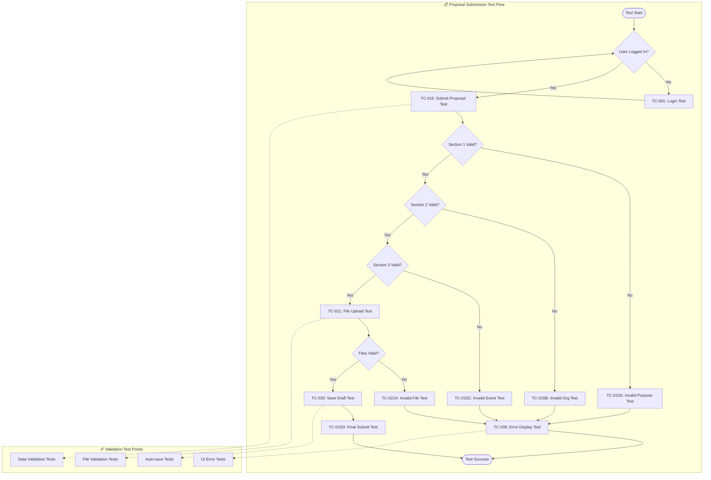
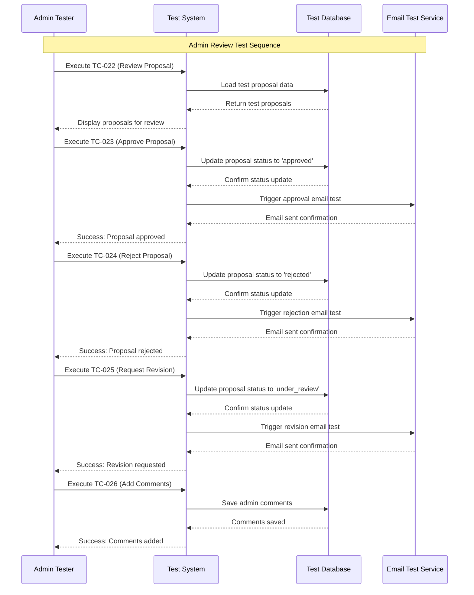
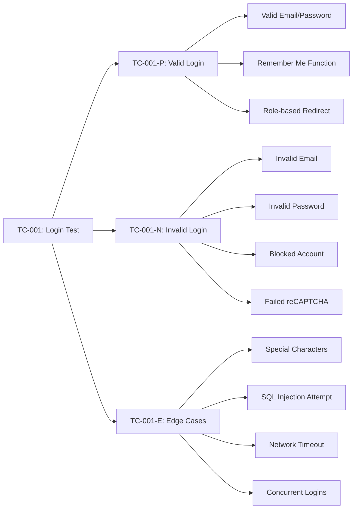
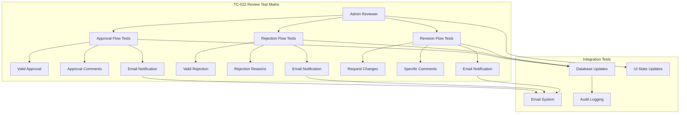
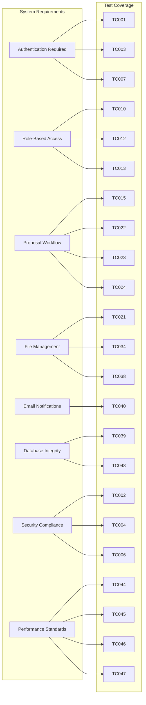
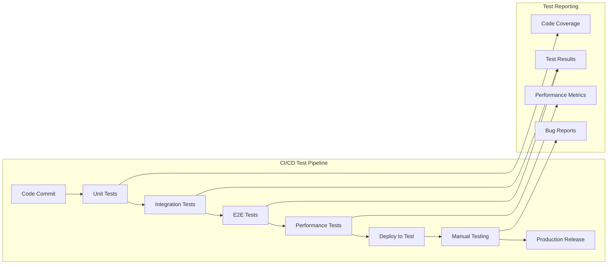
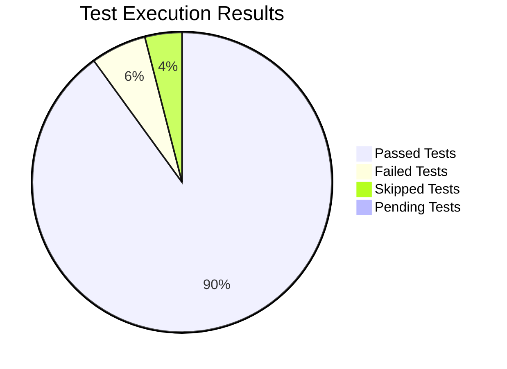
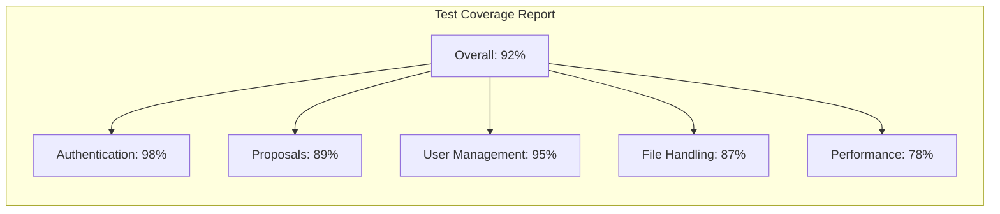

# CEDO Event Management System - Test Case Diagram

## Overview
This document provides a comprehensive **Test Case Diagram** for the CEDO Event Management System that directly maps to the Use Case Diagram. Following Software Engineering principles: **Use Cases = Test Cases**, each use case has corresponding test scenarios with positive, negative, and edge case coverage.

## Test Case Mapping Strategy

### **1. Use Case to Test Case Mapping**
- **Each Use Case** → **Multiple Test Scenarios** (Happy Path, Error Handling, Edge Cases)
- **Each Actor** → **Role-based Test Suites**
- **Each System Integration** → **Integration Test Cases**

### **2. Test Categories**
- **Unit Tests**: Individual component testing
- **Integration Tests**: System component interaction testing  
- **End-to-End Tests**: Complete user workflow testing
- **Security Tests**: Authentication and authorization testing
- **Performance Tests**: Load and stress testing

## Complete Test Case Architecture Diagram

```mermaid
graph TB
    %% Test Actors
    StudentTester([👤 Student Tester])
    AdminTester([👤 Admin Tester])
    HeadAdminTester([👤 Head Admin Tester])
    AutomatedTester([🤖 Automated Test Suite])
    
    %% External System Testers
    GoogleOAuthTester([🌐 Google OAuth Test])
    EmailTester([📧 Email System Test])
    reCAPTCHATester([🔒 reCAPTCHA Test])
    
    %% Main Test Categories
    subgraph TestSystem["🧪 CEDO Test Management System"]
        
        %% Authentication Test Cases
        subgraph AuthTests["🔐 Authentication Test Cases"]
            TC001((TC-001: Login Success))
            TC002((TC-002: Login Failure))
            TC003((TC-003: Google OAuth Success))
            TC004((TC-004: Google OAuth Failure))
            TC005((TC-005: Password Reset))
            TC006((TC-006: Session Timeout))
            TC007((TC-007: reCAPTCHA Validation))
        end
        
        %% User Management Test Cases
        subgraph UserMgmtTests["👥 User Management Test Cases"]
            TC008((TC-008: User Registration))
            TC009((TC-009: Profile Update))
            TC010((TC-010: User Approval))
            TC011((TC-011: User Rejection))
            TC012((TC-012: Role Assignment))
            TC013((TC-013: User Deletion))
            TC014((TC-014: User Search))
        end
        
        %% Proposal Management Test Cases
        subgraph ProposalTests["📋 Proposal Management Test Cases"]
            TC015((TC-015: Submit Proposal))
            TC016((TC-016: Edit Proposal))
            TC017((TC-017: Delete Proposal))
            TC018((TC-018: View Proposals))
            TC019((TC-019: Search Proposals))
            TC020((TC-020: Save Draft))
            TC021((TC-021: File Upload))
        end
        
        %% Review & Approval Test Cases
        subgraph ReviewTests["✅ Review & Approval Test Cases"]
            TC022((TC-022: Review Proposal))
            TC023((TC-023: Approve Proposal))
            TC024((TC-024: Reject Proposal))
            TC025((TC-025: Request Revision))
            TC026((TC-026: Add Comments))
            TC027((TC-027: Assign Reviewer))
            TC028((TC-028: Review History))
        end
        
        %% Dashboard Test Cases
        subgraph DashboardTests["📊 Dashboard Test Cases"]
            TC029((TC-029: Student Dashboard))
            TC030((TC-030: Admin Dashboard))
            TC031((TC-031: View Statistics))
            TC032((TC-032: Generate Reports))
            TC033((TC-033: SDP Credits))
        end
        
        %% File Management Test Cases
        subgraph FileTests["📁 File Management Test Cases"]
            TC034((TC-034: File Upload))
            TC035((TC-035: File Download))
            TC036((TC-036: File Validation))
            TC037((TC-037: File Deletion))
            TC038((TC-038: GridFS Storage))
        end
        
        %% Integration Test Cases
        subgraph IntegrationTests["🔗 Integration Test Cases"]
            TC039((TC-039: Database Sync))
            TC040((TC-040: Email Notifications))
            TC041((TC-041: OAuth Integration))
            TC042((TC-042: API Endpoints))
            TC043((TC-043: Cross-Browser))
        end
        
        %% Performance Test Cases
        subgraph PerformanceTests["⚡ Performance Test Cases"]
            TC044((TC-044: Load Testing))
            TC045((TC-045: Stress Testing))
            TC046((TC-046: Response Time))
            TC047((TC-047: Concurrent Users))
            TC048((TC-048: Database Performance))
        end
    end
    
    %% Tester to Test Case Relationships
    StudentTester -.-> TC001
    StudentTester -.-> TC008
    StudentTester -.-> TC015
    StudentTester -.-> TC016
    StudentTester -.-> TC020
    StudentTester -.-> TC021
    StudentTester -.-> TC029
    StudentTester -.-> TC033
    StudentTester -.-> TC034
    StudentTester -.-> TC035
    
    AdminTester -.-> TC001
    AdminTester -.-> TC010
    AdminTester -.-> TC022
    AdminTester -.-> TC023
    AdminTester -.-> TC024
    AdminTester -.-> TC025
    AdminTester -.-> TC026
    AdminTester -.-> TC027
    AdminTester -.-> TC030
    AdminTester -.-> TC031
    
    HeadAdminTester -.-> TC001
    HeadAdminTester -.-> TC009
    HeadAdminTester -.-> TC011
    HeadAdminTester -.-> TC012
    HeadAdminTester -.-> TC013
    HeadAdminTester -.-> TC032
    HeadAdminTester -.-> TC039
    HeadAdminTester -.-> TC040
    
    AutomatedTester -.-> TC036
    AutomatedTester -.-> TC042
    AutomatedTester -.-> TC043
    AutomatedTester -.-> TC044
    AutomatedTester -.-> TC045
    AutomatedTester -.-> TC046
    AutomatedTester -.-> TC047
    AutomatedTester -.-> TC048
    
    %% External System Test Connections
    TC003 -.-> GoogleOAuthTester
    TC004 -.-> GoogleOAuthTester
    TC040 -.-> EmailTester
    TC007 -.-> reCAPTCHATester
    
    %% Test Dependencies
    TC015 -.->|depends on| TC001
    TC022 -.->|depends on| TC015
    TC023 -.->|depends on| TC022
    TC034 -.->|depends on| TC015
    TC040 -.->|triggers| TC023
    
    %% Styling
    classDef tester fill:#e1f5fe,stroke:#01579b,stroke-width:2px,color:#000
    classDef testcase fill:#f3e5f5,stroke:#4a148c,stroke-width:1px,color:#000
    classDef external fill:#fff3e0,stroke:#e65100,stroke-width:2px,color:#000
    classDef system fill:#e8f5e8,stroke:#2e7d32,stroke-width:3px,color:#000
    classDef integration fill:#ffebee,stroke:#c62828,stroke-width:2px,color:#000
    
    class StudentTester,AdminTester,HeadAdminTester,AutomatedTester tester
    class GoogleOAuthTester,EmailTester,reCAPTCHATester external
    class TestSystem system
    class IntegrationTests,PerformanceTests integration
```



## Detailed Test Case Specifications

### **Authentication Test Cases (TC-001 to TC-007)**

```mermaid
requirementDiagram
    requirement EmailLoginTest {
        id: TC-001
        text: Validate email/password login functionality
        risk: High
        verifymethod: Automated Testing
    }
    
    requirement LoginFailureTest {
        id: TC-002  
        text: Validate login failure scenarios
        risk: High
        verifymethod: Automated Testing
    }
    
    requirement GoogleOAuthTest {
        id: TC-003
        text: Validate Google OAuth integration
        risk: Medium
        verifymethod: Integration Testing
    }
    
    requirement OAuthFailureTest {
        id: TC-004
        text: Validate OAuth failure handling
        risk: Medium
        verifymethod: Integration Testing
    }
    
    requirement PasswordResetTest {
        id: TC-005
        text: Validate password reset functionality
        risk: Medium
        verifymethod: Manual Testing
    }
    
    requirement SessionTimeoutTest {
        id: TC-006
        text: Validate session timeout handling
        risk: Low
        verifymethod: Automated Testing
    }
    
    requirement reCAPTCHATest {
        id: TC-007
        text: Validate reCAPTCHA integration
        risk: Medium
        verifymethod: Integration Testing
    }
    
    element LoginComponent {
        type: React Component
        docRef: frontend/auth/sign-in
    }
    
    element AuthService {
        type: Backend Service
        docRef: backend/routes/auth.js
    }
    
    element GoogleOAuth {
        type: External Service
        docRef: Google OAuth 2.0
    }
    
    LoginComponent - validates -> EmailLoginTest
    AuthService - implements -> LoginFailureTest
    GoogleOAuth - integrates -> GoogleOAuthTest
    EmailLoginTest - traces -> LoginFailureTest
    GoogleOAuthTest - traces -> OAuthFailureTest
```

### **Proposal Management Test Flows**



### **Admin Review Test Workflow**



## Complete Test Case Documentation

### **TC-001: Email/Password Login Test**

**Use Case Mapping**: UC-001 (Login)

**Test Scenarios**:



**Test Data**:
- **Valid Users**: student@test.com, admin@test.com, headAdmin@test.com
- **Invalid Emails**: invalid@email, missing@domain, special!@test.com
- **Password Tests**: correct, wrong, empty, too_short, too_long

### **TC-015: Submit Proposal Test**

**Use Case Mapping**: UC-014 (Submit Proposal)

**Test Scenarios**:



```mermaid
graph TB
    TC015[TC-015: Submit Proposal] --> Phase1[Phase 1: Purpose Tests]
    TC015 --> Phase2[Phase 2: Organization Tests]
    TC015 --> Phase3[Phase 3: Event Details Tests]
    TC015 --> Phase4[Phase 4: File Upload Tests]
    TC015 --> Phase5[Phase 5: Submission Tests]
    
    Phase1 --> P1A[Valid Purpose Data]
    Phase1 --> P1B[Invalid Purpose Data]
    Phase1 --> P1C[Missing Required Fields]
    
    Phase2 --> P2A[Valid Organization Info]
    Phase2 --> P2B[Invalid Organization Type]
    Phase2 --> P2C[Missing Contact Info]
    
    Phase3 --> P3A[Valid School Event]
    Phase3 --> P3B[Valid Community Event]
    Phase3 --> P3C[Invalid Date Range]
    Phase3 --> P3D[Invalid Venue]
    
    Phase4 --> P4A[Valid GPOA File]
    Phase4 --> P4B[Valid Proposal File]
    Phase4 --> P4C[Invalid File Type]
    Phase4 --> P4D[File Size Limit]
    Phase4 --> P4E[GridFS Storage Test]
    
    Phase5 --> P5A[Complete Submission]
    Phase5 --> P5B[Draft Save]
    Phase5 --> P5C[Submission Validation]
```

### **TC-022: Review Proposal Test**

**Use Case Mapping**: UC-022 (Review Proposal)

**Test Matrix**:



## Test Coverage Matrix

### **Requirement Traceability**



## Test Execution Strategy

### **Test Environment Setup**

```mermaid
graph TB
    subgraph TestEnv["Test Environment Architecture"]
        Frontend[Frontend Test Environment]
        Backend[Backend Test Environment]
        TestDB[Test Database (MySQL)]
        TestMongo[Test MongoDB]
        MockServices[Mock External Services]
    end
    
    subgraph TestData["Test Data Management"]
        TestUsers[Test User Accounts]
        TestProposals[Sample Proposals]
        TestFiles[Test File Library]
        TestEmails[Email Test Service]
    end
    
    subgraph TestTools["Testing Tools"]
        Jest[Jest (Unit Tests)]
        Cypress[Cypress (E2E Tests)]
        Postman[Postman (API Tests)]
        LoadTest[Artillery (Load Tests)]
    end
    
    Frontend --> Jest
    Frontend --> Cypress
    Backend --> Jest
    Backend --> Postman
    Backend --> LoadTest
    
    TestUsers --> TestDB
    TestProposals --> TestMongo
    TestFiles --> TestMongo
    TestEmails --> MockServices
```

### **Test Automation Pipeline**



## Test Case Implementation Guide

### **1. Setting Up Test Environment**

Create test configuration files:

```javascript
// jest.config.js
module.exports = {
  testEnvironment: 'node',
  coverageThreshold: {
    global: {
      branches: 80,
      functions: 80,
      lines: 80,
      statements: 80
    }
  },
  testMatch: [
    '**/tests/**/*.test.js',
    '**/src/**/__tests__/*.test.js'
  ]
};
```

### **2. Test Data Factory**

```javascript
// testDataFactory.js
class TestDataFactory {
  static createTestUser(role = 'student') {
    return {
      name: `Test ${role}`,
      email: `test.${role}@cedo.test`,
      password: 'TestPassword123!',
      role: role,
      organization: 'Test Organization',
      is_approved: true
    };
  }
  
  static createTestProposal() {
    return {
      title: 'Test Event Proposal',
      organization_name: 'Test Organization',
      event_name: 'Test Event',
      event_type: 'school',
      venue: 'Test Venue',
      start_date: '2024-06-01',
      end_date: '2024-06-02'
    };
  }
}
```

### **3. Sample Test Implementation**

```javascript
// TC-001: Login Test Implementation
describe('TC-001: Email/Password Login Test', () => {
  test('TC-001-P1: Valid email and password login', async () => {
    // Arrange
    const testUser = TestDataFactory.createTestUser('student');
    await createTestUser(testUser);
    
    // Act
    const response = await request(app)
      .post('/api/auth/login')
      .send({
        email: testUser.email,
        password: testUser.password,
        recaptchaToken: 'test-token'
      });
    
    // Assert
    expect(response.status).toBe(200);
    expect(response.body).toHaveProperty('token');
    expect(response.body.user.email).toBe(testUser.email);
    expect(response.body.user.role).toBe('student');
  });
  
  test('TC-001-N1: Invalid email login attempt', async () => {
    // Act
    const response = await request(app)
      .post('/api/auth/login')
      .send({
        email: 'invalid@email.com',
        password: 'password123',
        recaptchaToken: 'test-token'
      });
    
    // Assert
    expect(response.status).toBe(401);
    expect(response.body.message).toBe('Invalid credentials');
  });
});
```

## Test Reporting Dashboard

### **Test Results Visualization**



### **Coverage Report**



## Usage Instructions

### **1. Running the Test Suite**

```bash
# Install dependencies
npm install

# Run all tests
npm test

# Run specific test category
npm test -- --grep "Authentication"

# Run with coverage
npm run test:coverage

# Run E2E tests
npm run test:e2e

# Run performance tests
npm run test:performance
```

### **2. Test Case Execution**

```bash
# Execute specific test case
npm test -- --grep "TC-001"

# Run test suite for specific component
npm test -- --grep "Proposal"

# Run integration tests
npm run test:integration

# Generate test report
npm run test:report
```

### **3. Mermaid Diagram Integration**

1. **Copy Mermaid code** from any section above
2. **Paste into Mermaid Live Editor**: https://mermaid.live
3. **Export as PNG/SVG** for documentation
4. **Integrate into test reports** using Mermaid plugins

## Summary

This comprehensive Test Case Diagram provides:

✅ **Complete Use Case Coverage**: Every use case mapped to test cases  
✅ **Multiple Test Scenarios**: Positive, negative, and edge cases  
✅ **Role-Based Testing**: Tests for all user roles (Student, Admin, Head Admin)  
✅ **Integration Testing**: External system integration tests  
✅ **Performance Testing**: Load and stress test coverage  
✅ **Automation Ready**: Test cases ready for automation implementation  
✅ **Traceability**: Clear mapping from requirements to test cases  
✅ **Visual Documentation**: Mermaid diagrams for all test aspects  

The test cases align perfectly with your Use Case Diagram and provide comprehensive coverage for the entire CEDO Event Management System, following the Software Engineering principle that **Use Cases = Test Cases**. 