# CEDO Event Management System - Mermaid Use Case Diagram Code

## Overview
This file contains the precise Mermaid code for creating a Use Case diagram for the CEDO Event Management System. The diagram follows UML Use Case diagram standards with proper actor-use case relationships.

## Mermaid Use Case Diagram Code

```mermaid
flowchart TB
    %% Define Actors
    Student([👤 Student])
    Admin([👤 Admin])
    HeadAdmin([👤 Head Admin])
    
    %% External Systems
    GoogleOAuth([🌐 Google OAuth])
    EmailSystem([📧 Email System])
    reCAPTCHA([🔒 reCAPTCHA])
    
    %% System Boundary
    subgraph CEDO_System["🎓 CEDO Event Management System"]
        direction TB
        
        %% Authentication Use Cases
        subgraph Auth["🔐 Authentication"]
            UC001((Login))
            UC002((Register))
            UC003((Google Sign-In))
            UC004((Logout))
            UC005((Forgot Password))
            UC006((Reset Password))
        end
        
        %% User Management Use Cases
        subgraph UserMgmt["👥 User Management"]
            UC007((View Profile))
            UC008((Update Profile))
            UC009((Manage Users))
            UC010((Approve Students))
            UC011((View User List))
            UC012((Delete User))
            UC013((Update User Role))
        end
        
        %% Proposal Management Use Cases
        subgraph ProposalMgmt["📋 Proposal Management"]
            UC014((Submit Proposal))
            UC015((View Proposals))
            UC016((Edit Proposal))
            UC017((Delete Proposal))
            UC018((View Own Proposals))
            UC019((Search Proposals))
            UC020((Filter Proposals))
            UC021((Save Draft))
        end
        
        %% Review & Approval Use Cases
        subgraph ReviewApproval["✅ Review & Approval"]
            UC022((Review Proposal))
            UC023((Approve Proposal))
            UC024((Reject Proposal))
            UC025((Request Revision))
            UC026((Add Comments))
            UC027((Assign Reviewer))
            UC028((View Review History))
            UC029((Update Status))
        end
        
        %% Dashboard Use Cases
        subgraph Dashboard["📊 Dashboard"]
            UC030((View Student Dashboard))
            UC031((View Admin Dashboard))
            UC032((View Statistics))
            UC033((View Reports))
            UC034((Generate Reports))
            UC035((View SDP Credits))
        end
        
        %% Event Management Use Cases
        subgraph EventMgmt["🎪 Event Management"]
            UC036((Create Event))
            UC037((Manage Events))
            UC038((View Events))
            UC039((Update Event Status))
            UC040((View Event Details))
            UC041((Schedule Event))
        end
        
        %% Notification Use Cases
        subgraph Notifications["🔔 Notifications"]
            UC042((Send Notification))
            UC043((View Notifications))
            UC044((Email Notification))
            UC045((System Notification))
        end
        
        %% File Management Use Cases
        subgraph FileMgmt["📁 File Management"]
            UC046((Upload Files))
            UC047((Download Files))
            UC048((Manage Documents))
            UC049((View Attachments))
            UC050((Delete Files))
        end
        
        %% System Administration Use Cases
        subgraph SystemAdmin["⚙️ System Administration"]
            UC051((Manage System))
            UC052((View Logs))
            UC053((Backup Data))
            UC054((Manage Database))
            UC055((System Maintenance))
        end
    end
    
    %% Student Actor Relationships
    Student -.-> UC001
    Student -.-> UC002
    Student -.-> UC003
    Student -.-> UC004
    Student -.-> UC007
    Student -.-> UC008
    Student -.-> UC014
    Student -.-> UC016
    Student -.-> UC018
    Student -.-> UC021
    Student -.-> UC030
    Student -.-> UC035
    Student -.-> UC038
    Student -.-> UC043
    Student -.-> UC046
    Student -.-> UC047
    Student -.-> UC049
    
    %% Admin Actor Relationships
    Admin -.-> UC001
    Admin -.-> UC003
    Admin -.-> UC004
    Admin -.-> UC007
    Admin -.-> UC008
    Admin -.-> UC010
    Admin -.-> UC015
    Admin -.-> UC019
    Admin -.-> UC020
    Admin -.-> UC022
    Admin -.-> UC023
    Admin -.-> UC024
    Admin -.-> UC025
    Admin -.-> UC026
    Admin -.-> UC027
    Admin -.-> UC028
    Admin -.-> UC029
    Admin -.-> UC031
    Admin -.-> UC032
    Admin -.-> UC033
    Admin -.-> UC037
    Admin -.-> UC039
    Admin -.-> UC042
    Admin -.-> UC044
    
    %% Head Admin Actor Relationships (All Use Cases)
    HeadAdmin -.-> UC001
    HeadAdmin -.-> UC003
    HeadAdmin -.-> UC004
    HeadAdmin -.-> UC007
    HeadAdmin -.-> UC008
    HeadAdmin -.-> UC009
    HeadAdmin -.-> UC010
    HeadAdmin -.-> UC011
    HeadAdmin -.-> UC012
    HeadAdmin -.-> UC013
    HeadAdmin -.-> UC015
    HeadAdmin -.-> UC019
    HeadAdmin -.-> UC020
    HeadAdmin -.-> UC022
    HeadAdmin -.-> UC023
    HeadAdmin -.-> UC024
    HeadAdmin -.-> UC025
    HeadAdmin -.-> UC026
    HeadAdmin -.-> UC027
    HeadAdmin -.-> UC028
    HeadAdmin -.-> UC029
    HeadAdmin -.-> UC031
    HeadAdmin -.-> UC032
    HeadAdmin -.-> UC033
    HeadAdmin -.-> UC034
    HeadAdmin -.-> UC037
    HeadAdmin -.-> UC039
    HeadAdmin -.-> UC041
    HeadAdmin -.-> UC042
    HeadAdmin -.-> UC044
    HeadAdmin -.-> UC048
    HeadAdmin -.-> UC050
    HeadAdmin -.-> UC051
    HeadAdmin -.-> UC052
    HeadAdmin -.-> UC053
    HeadAdmin -.-> UC054
    HeadAdmin -.-> UC055
    
    %% External System Connections
    UC003 -.-> GoogleOAuth
    UC044 -.-> EmailSystem
    UC001 -.-> reCAPTCHA
    UC002 -.-> reCAPTCHA
    
    %% Include Relationships
    UC001 -.->|<<include>>| reCAPTCHA
    UC002 -.->|<<include>>| reCAPTCHA
    UC003 -.->|<<include>>| GoogleOAuth
    UC014 -.->|<<include>>| UC046
    UC022 -.->|<<include>>| UC026
    UC023 -.->|<<include>>| UC042
    UC024 -.->|<<include>>| UC042
    UC010 -.->|<<include>>| UC044
    UC016 -.->|<<include>>| UC021
    
    %% Extend Relationships
    UC015 -.->|<<extend>>| UC019
    UC015 -.->|<<extend>>| UC020
    UC022 -.->|<<extend>>| UC025
    UC009 -.->|<<extend>>| UC010
    UC030 -.->|<<extend>>| UC035
    UC014 -.->|<<extend>>| UC021
    
    %% Styling
    classDef actor fill:#e1f5fe,stroke:#01579b,stroke-width:2px,color:#000
    classDef usecase fill:#f3e5f5,stroke:#4a148c,stroke-width:1px,color:#000
    classDef external fill:#fff3e0,stroke:#e65100,stroke-width:2px,color:#000
    classDef system fill:#e8f5e8,stroke:#2e7d32,stroke-width:3px,color:#000
    classDef subsystem fill:#f1f8e9,stroke:#33691e,stroke-width:1px,color:#000
    
    class Student,Admin,HeadAdmin actor
    class GoogleOAuth,EmailSystem,reCAPTCHA external
    class CEDO_System system
    class Auth,UserMgmt,ProposalMgmt,ReviewApproval,Dashboard,EventMgmt,Notifications,FileMgmt,SystemAdmin subsystem
```

## Alternative Simplified Version

```mermaid
graph TB
    %% Actors
    Student([👤 Student])
    Admin([👤 Admin])
    HeadAdmin([👤 Head Admin])
    
    %% External Systems
    Google([🌐 Google OAuth])
    Email([📧 Email System])
    Captcha([🔒 reCAPTCHA])
    
    %% Main Use Cases
    subgraph System["CEDO Event Management System"]
        Login((Login))
        Register((Register))
        GoogleAuth((Google Sign-In))
        
        SubmitProposal((Submit Event Proposal))
        ReviewProposal((Review Proposal))
        ApproveProposal((Approve Proposal))
        RejectProposal((Reject Proposal))
        
        ViewDashboard((View Dashboard))
        ManageUsers((Manage Users))
        ApproveStudents((Approve Students))
        
        ViewProfile((View Profile))
        UpdateProfile((Update Profile))
        
        UploadFiles((Upload Files))
        ViewReports((View Reports))
        SendNotifications((Send Notifications))
        
        SystemAdmin((System Administration))
    end
    
    %% Student Connections
    Student -.-> Login
    Student -.-> Register
    Student -.-> GoogleAuth
    Student -.-> SubmitProposal
    Student -.-> ViewDashboard
    Student -.-> ViewProfile
    Student -.-> UpdateProfile
    Student -.-> UploadFiles
    
    %% Admin Connections
    Admin -.-> Login
    Admin -.-> GoogleAuth
    Admin -.-> ReviewProposal
    Admin -.-> ApproveProposal
    Admin -.-> RejectProposal
    Admin -.-> ApproveStudents
    Admin -.-> ViewDashboard
    Admin -.-> ViewProfile
    Admin -.-> UpdateProfile
    Admin -.-> ViewReports
    Admin -.-> SendNotifications
    
    %% Head Admin Connections
    HeadAdmin -.-> Login
    HeadAdmin -.-> GoogleAuth
    HeadAdmin -.-> ReviewProposal
    HeadAdmin -.-> ApproveProposal
    HeadAdmin -.-> RejectProposal
    HeadAdmin -.-> ManageUsers
    HeadAdmin -.-> ApproveStudents
    HeadAdmin -.-> ViewDashboard
    HeadAdmin -.-> ViewProfile
    HeadAdmin -.-> UpdateProfile
    HeadAdmin -.-> ViewReports
    HeadAdmin -.-> SendNotifications
    HeadAdmin -.-> SystemAdmin
    
    %% External System Connections
    GoogleAuth -.-> Google
    SendNotifications -.-> Email
    Login -.-> Captcha
    Register -.-> Captcha
    
    %% Styling
    classDef actor fill:#e1f5fe,stroke:#01579b,stroke-width:2px
    classDef usecase fill:#f3e5f5,stroke:#4a148c,stroke-width:1px
    classDef external fill:#fff3e0,stroke:#e65100,stroke-width:2px
    
    class Student,Admin,HeadAdmin actor
    class Google,Email,Captcha external
```

## Usage Instructions

1. **Copy the Mermaid code** from either version above
2. **Paste into any Mermaid-compatible tool**:
   - Mermaid Live Editor (https://mermaid.live)
   - GitHub README files
   - GitLab wikis
   - Notion pages
   - VS Code with Mermaid extension
   - Draw.io with Mermaid plugin

3. **For Little Mermaid 2 The SQL tool** (referenced from the web search):
   - This tool is specifically for ER diagrams to SQL conversion
   - Not directly applicable for Use Case diagrams
   - But you can use the Mermaid syntax above in any standard Mermaid renderer

## Key Features of This Diagram

✅ **Proper UML Use Case Notation**
- Actors represented as stick figures/personas
- Use cases as ovals/ellipses
- System boundary clearly defined
- Include and extend relationships shown

✅ **Complete CEDO System Coverage**
- All 3 user roles (Student, Admin, Head Admin)
- All major use cases from your system
- External system integrations
- Proper relationship mappings

✅ **Mermaid-Compatible Syntax**
- Uses standard Mermaid flowchart syntax
- Proper styling and theming
- Clean, readable structure
- Scalable and maintainable

## Export Options

Once rendered, you can export the diagram as:
- PNG image
- SVG vector graphic
- PDF document
- HTML embed code

This code creates a professional, precise Use Case diagram that accurately represents your CEDO Event Management System! 