# CEDO Event Management System - Use Case Diagram

## Overview
This document provides a comprehensive Use Case diagram for the CEDO (Event Management) System based on actual codebase analysis. The system supports event proposal submission, review, and approval workflows with role-based access control.

## System Actors

### Primary Actors
1. **Student** - Submits event proposals, views dashboard, manages profile
2. **Admin** - Reviews proposals, manages users, approves students
3. **Head Admin** - Full system administration privileges

### External Systems
1. **Google OAuth** - Authentication service
2. **Email System** - Notification delivery
3. **reCAPTCHA** - Security validation

## Use Case Diagram (Mermaid)

```mermaid
graph TB
    %% Actors
    Student["👤 Student"]
    Admin["👤 Admin"]
    HeadAdmin["👤 Head Admin"]
    GoogleOAuth["🌐 Google OAuth"]
    EmailSystem["📧 Email System"]
    reCAPTCHA["🔒 reCAPTCHA"]

    %% System Boundary
    subgraph CEDO["🎓 CEDO Event Management System"]
        
        %% Authentication Package
        subgraph Auth["🔐 Authentication"]
            Login["Login"]
            Register["Register with Email"]
            GoogleSignIn["Google Sign-In"]
            Logout["Logout"]
            ForgotPassword["Forgot Password"]
            ResetPassword["Reset Password"]
        end

        %% User Management Package
        subgraph UserMgmt["👥 User Management"]
            ViewProfile["View Profile"]
            UpdateProfile["Update Profile"]
            ManageUsers["Manage Users"]
            ApproveStudents["Approve Student Accounts"]
            ViewUserList["View User List"]
            DeleteUser["Delete User"]
            UpdateUserRole["Update User Role"]
        end

        %% Proposal Management Package
        subgraph ProposalMgmt["📋 Proposal Management"]
            SubmitProposal["Submit Event Proposal"]
            ViewProposals["View Proposals"]
            EditProposal["Edit Proposal"]
            DeleteProposal["Delete Proposal"]
            ViewOwnProposals["View Own Proposals"]
            SearchProposals["Search Proposals"]
            FilterProposals["Filter Proposals"]
            SaveDraft["Save Draft"]
        end

        %% Review & Approval Package
        subgraph ReviewApproval["✅ Review & Approval"]
            ReviewProposal["Review Proposal"]
            ApproveProposal["Approve Proposal"]
            RejectProposal["Reject Proposal"]
            RequestRevision["Request Revision"]
            AddComments["Add Review Comments"]
            AssignReviewer["Assign Reviewer"]
            ViewReviewHistory["View Review History"]
            UpdateProposalStatus["Update Proposal Status"]
        end

        %% Dashboard Package
        subgraph Dashboard["📊 Dashboard"]
            ViewStudentDashboard["View Student Dashboard"]
            ViewAdminDashboard["View Admin Dashboard"]
            ViewStatistics["View Statistics"]
            ViewReports["View Reports"]
            GenerateReports["Generate Reports"]
            ViewSDPCredits["View SDP Credits"]
        end

        %% Event Management Package
        subgraph EventMgmt["🎪 Event Management"]
            CreateEvent["Create Event"]
            ManageEvents["Manage Events"]
            ViewEvents["View Events"]
            UpdateEventStatus["Update Event Status"]
            ViewEventDetails["View Event Details"]
            ScheduleEvent["Schedule Event"]
        end

        %% Notification Package
        subgraph Notifications["🔔 Notifications"]
            SendNotification["Send Notification"]
            ViewNotifications["View Notifications"]
            EmailNotification["Email Notification"]
            SystemNotification["System Notification"]
        end

        %% File Management Package
        subgraph FileMgmt["📁 File Management"]
            UploadFiles["Upload Files"]
            DownloadFiles["Download Files"]
            ManageDocuments["Manage Documents"]
            ViewAttachments["View Attachments"]
            DeleteFiles["Delete Files"]
        end

        %% System Admin Package
        subgraph SystemAdmin["⚙️ System Administration"]
            ManageSystem["Manage System Settings"]
            ViewLogs["View System Logs"]
            BackupData["Backup Data"]
            ManageDatabase["Manage Database"]
            SystemMaintenance["System Maintenance"]
        end
    end

    %% Student Connections
    Student --> Login
    Student --> Register
    Student --> GoogleSignIn
    Student --> ViewProfile
    Student --> UpdateProfile
    Student --> SubmitProposal
    Student --> ViewOwnProposals
    Student --> EditProposal
    Student --> SaveDraft
    Student --> ViewStudentDashboard
    Student --> ViewNotifications
    Student --> UploadFiles
    Student --> ViewEvents
    Student --> ViewSDPCredits


    %% Admin Connections
    Admin --> Login
    Admin --> GoogleSignIn
    Admin --> ViewProfile
    Admin --> UpdateProfile
    Admin --> ViewProposals
    Admin --> ReviewProposal
    Admin --> ApproveProposal
    Admin --> RejectProposal
    Admin --> RequestRevision
    Admin --> AddComments
    Admin --> AssignReviewer
    Admin --> ApproveStudents
    Admin --> ViewAdminDashboard
    Admin --> ViewStatistics
    Admin --> ViewReports
    Admin --> ManageEvents
    Admin --> SendNotification
    Admin --> UpdateProposalStatus
    Admin --> ViewReviewHistory

    %% Head Admin Connections (All privileges)
    HeadAdmin --> Login
    HeadAdmin --> GoogleSignIn
    HeadAdmin --> ViewProfile
    HeadAdmin --> UpdateProfile
    HeadAdmin --> ManageUsers
    HeadAdmin --> ApproveStudents
    HeadAdmin --> ViewUserList
    HeadAdmin --> DeleteUser
    HeadAdmin --> UpdateUserRole
    HeadAdmin --> ViewProposals
    HeadAdmin --> ReviewProposal
    HeadAdmin --> ApproveProposal
    HeadAdmin --> RejectProposal
    HeadAdmin --> RequestRevision
    HeadAdmin --> AddComments
    HeadAdmin --> AssignReviewer
    HeadAdmin --> ViewAdminDashboard
    HeadAdmin --> ViewStatistics
    HeadAdmin --> ViewReports
    HeadAdmin --> GenerateReports
    HeadAdmin --> ManageEvents
    HeadAdmin --> UpdateEventStatus
    HeadAdmin --> SendNotification
    HeadAdmin --> EmailNotification
    HeadAdmin --> ManageDocuments
    HeadAdmin --> ManageSystem
    HeadAdmin --> ViewLogs
    HeadAdmin --> BackupData
    HeadAdmin --> ManageDatabase
    HeadAdmin --> SystemMaintenance

    %% External System Connections
    GoogleSignIn -.-> GoogleOAuth
    EmailNotification -.-> EmailSystem
    Login -.-> reCAPTCHA
    Register -.-> reCAPTCHA

    %% Include Relationships
    Login -.->|includes| reCAPTCHA
    Register -.->|includes| reCAPTCHA
    GoogleSignIn -.->|includes| GoogleOAuth
    SubmitProposal -.->|includes| UploadFiles
    ReviewProposal -.->|includes| AddComments
    ApproveProposal -.->|includes| SendNotification
    RejectProposal -.->|includes| SendNotification
    ApproveStudents -.->|includes| EmailNotification
    EditProposal -.->|includes| SaveDraft

    %% Extend Relationships
    ViewProposals -.->|extends| SearchProposals
    ViewProposals -.->|extends| FilterProposals
    ReviewProposal -.->|extends| RequestRevision
    ManageUsers -.->|extends| ApproveStudents
    ViewStudentDashboard -.->|extends| ViewSDPCredits
    SubmitProposal -.->|extends| SaveDraft

    %% Styling
    classDef actor fill:#e1f5fe,stroke:#01579b,stroke-width:2px,color:#000
    classDef usecase fill:#f3e5f5,stroke:#4a148c,stroke-width:1px,color:#000
    classDef external fill:#fff3e0,stroke:#e65100,stroke-width:2px,color:#000
    classDef system fill:#e8f5e8,stroke:#2e7d32,stroke-width:3px,color:#000

    class Student,Admin,HeadAdmin actor
    class GoogleOAuth,EmailSystem,reCAPTCHA external
    class CEDO system
```

## Detailed Use Case Descriptions

### Student Use Cases

#### Use Case: Submit Event Proposal (US-1)
**Actors**: Student  
**Description**: This use case describes how a student submits an event proposal so that their organization's activities can be reviewed and approved by the admin.  
**Preconditions**: The student has a valid approved account in the system.  
**Main Flow**:
1. Student logs into the CEDO system using their credentials or Google OAuth.
2. Student navigates to the proposal submission form in their dashboard.
3. Student fills in the necessary information including event purpose, organization details, and event specifics.
4. Student uploads required documents and attachments.
5. Student submits their proposal through the system.
6. Proposal data is saved to the system's MySQL database with "pending" status.
7. System displays confirmation message that proposal has been submitted successfully.
8. Admin is automatically notified of the new proposal submission via dashboard.  
**Postconditions**: The proposal is recorded in the system with "pending" status and is available for admin review.

#### Use Case: View Proposal Status (US-2)
**Actors**: Student  
**Description**: This use case describes how a student views the status of their submitted proposals (pending, approved, denied) so they know what actions to take next.  
**Preconditions**: Student has submitted at least one proposal and is logged into the system.  
**Main Flow**:
1. Student accesses their dashboard after logging into the system.
2. Student navigates to the "My Proposals" or "Proposal History" section.
3. System displays a list of all student's submitted proposals with current status indicators.
4. Student can see status for each proposal: "Pending", "Approved", "Denied", or "Revision Requested".
5. Student can click on individual proposals to view detailed information and any admin comments.
6. System provides visual indicators (colors, icons) to quickly identify proposal statuses.  
**Postconditions**: Student is informed of their proposal statuses and can determine next actions.

#### Use Case: View Admin Feedback and Revise Proposal (US-3, US-4)
**Actors**: Student  
**Description**: This use case describes how a student views admin comments and feedback when their proposal is denied, and can revise and resubmit it.  
**Preconditions**: Student has a proposal that has been denied or requires revision, and admin has provided feedback.  
**Main Flow**:
1. Student logs into the system and navigates to their proposal dashboard.
2. Student selects a proposal with "Denied" or "Revision Requested" status.
3. System displays the original proposal details along with admin comments and feedback.
4. Student reviews the admin feedback and understands required changes.
5. Student clicks "Edit Proposal" or "Revise and Resubmit" button.
6. Student makes necessary changes based on admin feedback.
7. Student updates proposal information, uploads additional documents if needed.
8. Student resubmits the revised proposal through the system.
9. System updates proposal status back to "Pending" and notifies admin of resubmission.  
**Postconditions**: The revised proposal is resubmitted with "pending" status and admin feedback has been addressed.

#### Use Case: Submit Accomplishment Report (US-5)
**Actors**: Student  
**Description**: This use case describes how a student submits accomplishment reports for approved events to complete the event workflow.  
**Preconditions**: Student has an approved event proposal and the event has been conducted.  
**Main Flow**:
1. Student logs into the system and navigates to their approved events list.
2. Student selects an approved event that requires an accomplishment report.
3. Student accesses the accomplishment report submission form.
4. Student fills in event outcomes, attendance figures, photos, and other required documentation.
5. Student uploads supporting documents, receipts, and evidence of event completion.
6. Student submits the accomplishment report through the system.
7. System saves the report with "pending review" status.
8. Admin/Head Admin is notified of the new accomplishment report submission.  
**Postconditions**: Accomplishment report is submitted and available for admin review to complete the event workflow.

#### Use Case: Track Organization Activities (US-6, US-7)
**Actors**: Student  
**Description**: This use case describes how a student views their approved and pending events and manages their organization's profile information.  
**Preconditions**: Student is logged into the system and has organizational activities.  
**Main Flow**:
1. Student accesses their dashboard and navigates to the "My Events" section.
2. System displays a comprehensive list of all organization's events categorized by status.
3. Student can filter events by: "Approved", "Pending", "Completed", "Upcoming".
4. Student views event details, dates, and current status for each activity.
5. Student navigates to organization profile management section.
6. Student reviews current organization information (name, contact details, members).
7. Student updates organization profile information as needed for accurate records.
8. System saves updated organization information and confirms changes.  
**Postconditions**: Student has visibility of all organizational activities and profile information is current.

### Authentication Use Cases

#### Use Case: User Authentication
**Actors**: Student, Admin, Head Admin  
**Description**: This use case describes how users authenticate into the CEDO system using either email/password credentials or Google OAuth integration.  
**Preconditions**: User has a valid registered account that has been approved by administrators.  
**Main Flow**:
1. User navigates to the CEDO system login page.
2. User chooses authentication method (email/password or Google Sign-In).
3. If email/password: User enters credentials and completes reCAPTCHA verification.
4. If Google OAuth: User is redirected to Google authentication and grants permissions.
5. System validates credentials and verifies user approval status.
6. System generates JWT authentication token for the session.
7. User is redirected to appropriate role-based dashboard (Student Dashboard, Admin Dashboard).
8. System logs the successful authentication event.  
**Postconditions**: User is authenticated and has access to role-appropriate system functions.

### Admin Use Cases

#### Use Case: Review and Approve Proposals (US-15)
**Actors**: Admin  
**Description**: This use case describes how an Admin reviews submitted proposals and approves or denies them, so that only valid events proceed.  
**Preconditions**: Admin is successfully logged into the system and there are pending proposals to review.  
**Main Flow**:
1. Admin accesses the admin dashboard and views list of pending proposals.
2. Admin selects a specific proposal to review from the queue.
3. System displays complete proposal details including all uploaded documents and attachments.
4. Admin evaluates the proposal against institutional criteria and policies.
5. Admin makes a decision: approve or deny the proposal.
6. System updates the proposal status and logs the review decision with timestamp.
7. System automatically sends email notification to the student with the approval/denial decision.  
**Postconditions**: Proposal status is updated, review is documented, and student is notified of the decision.

#### Use Case: Provide Comments on Proposals (US-16)
**Actors**: Admin  
**Description**: This use case describes how an Admin leaves comments on proposals so that submitters understand required revisions.  
**Preconditions**: Admin is reviewing a proposal that requires feedback or revisions.  
**Main Flow**:
1. Admin selects a proposal from the review queue.
2. Admin reviews the proposal details and identifies areas needing improvement.
3. Admin accesses the comments section of the proposal review interface.
4. Admin writes detailed, constructive comments explaining what needs to be revised.
5. Admin specifies required changes and provides guidance for improvement.
6. Admin saves the comments and updates proposal status to "Revision Requested".
7. System sends notification to student with admin comments and revision requirements.  
**Postconditions**: Student receives detailed feedback and knows exactly what revisions are needed.

#### Use Case: Review Accomplishment Reports (US-17)
**Actors**: Admin  
**Description**: This use case describes how an Admin views accomplishment reports submitted by students to verify their content.  
**Preconditions**: Students have submitted accomplishment reports for completed events.  
**Main Flow**:
1. Admin logs into the system and navigates to the accomplishment reports section.
2. Admin views list of submitted accomplishment reports awaiting review.
3. Admin selects a specific accomplishment report to review.
4. System displays the complete report including photos, attendance records, and supporting documents.
5. Admin verifies the content against the original approved proposal.
6. Admin confirms event completion and compliance with approved plan.
7. Admin approves or requests additional information from the student.  
**Postconditions**: Accomplishment report is reviewed and verified, completing the event workflow.

#### Use Case: Search and Filter Users (US-18)
**Actors**: Admin  
**Description**: This use case describes how an Admin filters and searches users by name, email, organization, or role to find and manage accounts efficiently.  
**Preconditions**: Admin has access to user management functionality.  
**Main Flow**:
1. Admin navigates to the user management section of the admin dashboard.
2. Admin accesses the user search and filter interface.
3. Admin can filter users by multiple criteria: name, email, organization, or role.
4. Admin enters search terms or selects filter options.
5. System displays filtered list of users matching the specified criteria.
6. Admin can view user details and perform management actions as needed.
7. Admin can export filtered user lists for administrative purposes.  
**Postconditions**: Admin efficiently locates specific users and can perform targeted account management.

### Head Admin Use Cases

#### Use Case: Review and Manage Proposals (US-8, US-9)
**Actors**: Head Admin  
**Description**: This use case describes how a Head Admin reviews submitted proposals, approves or denies them, and leaves comments and feedback on denied proposals.  
**Preconditions**: Head Admin is logged into the system with full administrative privileges.  
**Main Flow**:
1. Head Admin accesses the admin dashboard and views all pending proposals.
2. Head Admin selects proposals to review from the complete system queue.
3. Head Admin evaluates proposals against institutional standards and policies.
4. For approved proposals: Head Admin approves and system notifies student.
5. For denied proposals: Head Admin writes detailed feedback explaining reasons for denial.
6. Head Admin provides specific guidance on what improvements are needed.
7. System updates proposal status and sends comprehensive feedback to student.  
**Postconditions**: All proposals are properly reviewed with appropriate feedback, ensuring only valid events are conducted.

#### Use Case: Manage Accomplishment Reports (US-10)
**Actors**: Head Admin  
**Description**: This use case describes how a Head Admin views, approves, or rejects accomplishment reports submitted by students.  
**Preconditions**: Students have submitted accomplishment reports that require Head Admin review.  
**Main Flow**:
1. Head Admin accesses the accomplishment reports management section.
2. Head Admin reviews submitted reports including all documentation and evidence.
3. Head Admin verifies compliance with original approved proposal requirements.
4. Head Admin makes final approval decision or requests additional documentation.
5. For approved reports: Head Admin marks event as officially completed.
6. For rejected reports: Head Admin provides feedback on missing or inadequate information.
7. System updates event status and notifies student of final decision.  
**Postconditions**: Event workflow is completed with official Head Admin approval or clear feedback for improvement.

#### Use Case: Comprehensive User Management (US-11, US-12)
**Actors**: Head Admin  
**Description**: This use case describes how a Head Admin manages user accounts and filters/searches users for efficient user management.  
**Preconditions**: Head Admin has full system administrative privileges.  
**Main Flow**:
1. Head Admin accesses the comprehensive user management dashboard.
2. Head Admin can add new user accounts with appropriate role assignments.
3. Head Admin can edit existing user information and change user roles.
4. Head Admin can delete user accounts when necessary.
5. Head Admin can approve pending student registrations.
6. Head Admin uses advanced search filters by name, email, organization, or role.
7. Head Admin can perform bulk operations on filtered user groups.
8. System maintains complete audit trail of all user management actions.  
**Postconditions**: User accounts are properly managed, system security is maintained, and user data is up-to-date.

#### Use Case: System Auditing and Reporting (US-13, US-14)
**Actors**: Head Admin  
**Description**: This use case describes how a Head Admin views logs, tracks user actions for audit compliance, and generates comprehensive reports.  
**Preconditions**: Head Admin requires system oversight and reporting capabilities.  
**Main Flow**:
1. Head Admin accesses the system administration and reporting dashboard.
2. Head Admin views comprehensive logs of all user actions and system events.
3. Head Admin can filter logs by date range, user, action type, or organization.
4. Head Admin generates reports with specific date brackets and organization filters.
5. Head Admin can create overall organization reports or specific organizational reports.
6. Head Admin exports reports in various formats for compliance and audit purposes.
7. System provides real-time analytics and historical trend analysis.  
**Postconditions**: Complete audit trail is available, compliance requirements are met, and comprehensive reporting supports institutional oversight.

### Proposal Management Use Cases

#### UC-003: Submit Event Proposal
- **Primary Actor**: Student
- **Description**: User submits a new event proposal for review
- **Includes**: Upload Files
- **Main Flow**:
  1. User fills multi-step proposal form (Purpose, Organization, Event Details)
  2. User uploads required documents
  3. System validates proposal data
  4. System saves proposal with "pending" status
  5. System sends notification to assigned reviewers

#### UC-004: Review Proposal
- **Primary Actor**: Admin, Head Admin
- **Description**: Authorized user reviews and evaluates submitted proposal
- **Includes**: Add Comments
- **Main Flow**:
  1. User selects proposal to review from dashboard
  2. System displays complete proposal details and attachments
  3. User evaluates proposal against criteria
  4. User adds comments and makes decision (approve/reject/request revision)
  5. System updates proposal status
  6. System notifies submitter and other stakeholders

### User Management Use Cases

#### UC-005: Approve Student Accounts
- **Primary Actor**: Admin, Head Admin
- **Description**: Admin approves pending student registrations
- **Includes**: Email Notification
- **Main Flow**:
  1. Admin views pending student accounts in admin dashboard
  2. Admin reviews student information and credentials
  3. Admin approves or rejects account with optional comments
  4. System updates user approval status
  5. System sends email notification to student about decision

## Role-Based Access Control

### Student Permissions
- Submit and manage own event proposals
- View personal dashboard and SDP credits
- Upload files and documents
- View events and notifications
- Edit own profile information
- Save drafts and edit proposals

### Admin Permissions
- Review and evaluate proposals
- Add comments and feedback
- Approve/reject proposals
- Request revisions from submitters
- Assign reviewers to proposals
- Approve student accounts
- View statistics and reports
- Manage events and schedules
- Send system notifications
- Update proposal statuses
- View review history

### Head Admin Permissions
- All Admin permissions
- Full user management (create, update, delete users)
- System administration and settings
- Database management and backups
- Generate comprehensive reports
- Manage system logs and maintenance

## System Integration Points

### External Services
1. **Google OAuth**: Authentication and user profile data
2. **Email System**: Notifications and communications
3. **reCAPTCHA**: Security validation for forms

### Internal Components
1. **MySQL Database**: User and proposal data storage
2. **MongoDB**: File storage and document management
3. **JWT Authentication**: Session management
4. **File Upload System**: Document handling

## Security Considerations

1. **Authentication**: Multi-factor with Google OAuth and reCAPTCHA
2. **Authorization**: Role-based access control (RBAC)
3. **Data Protection**: Encrypted storage and transmission
4. **Session Management**: JWT tokens with expiration
5. **Input Validation**: Server-side validation for all inputs

## Technical Implementation Notes

- **Frontend**: Next.js with React components
- **Backend**: Node.js with Express framework
- **Database**: MySQL for structured data, MongoDB for files
- **Authentication**: JWT tokens with Google OAuth integration
- **File Storage**: GridFS for document management
- **Notifications**: Email integration for system notifications

This use case diagram represents the complete functionality of the CEDO Event Management System as implemented in the codebase, providing a comprehensive view of all user interactions and system capabilities. 