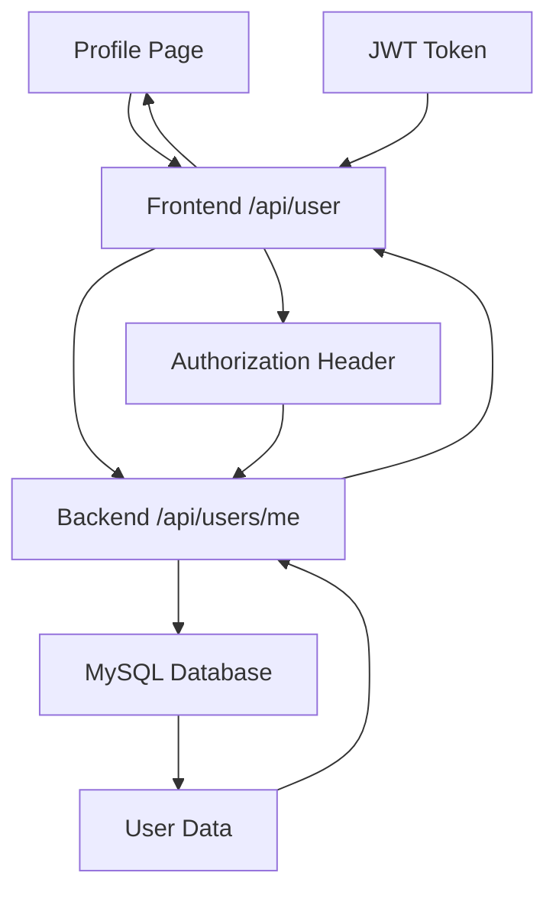

# 🔧 MySQL "Access Denied" Error - COMPLETE FIX

## 🚨 **PROBLEM IDENTIFIED**

**Error:** `Access denied for user 'root'@'localhost' (using password: NO)`

**Root Cause:** Frontend API route `/api/user` was trying to connect directly to MySQL without proper credentials, while your backend has working database connectivity.

---

## ✅ **SOLUTION IMPLEMENTED**

### **🔄 Architecture Change: Frontend → Backend API**

Instead of frontend connecting directly to MySQL (which caused the authentication error), the frontend now calls your working backend API.

### **📋 What Was Fixed:**

1. **❌ BEFORE:** Frontend `/api/user` → Direct MySQL connection (FAILED)
2. **✅ AFTER:** Frontend `/api/user` → Backend `/api/users/me` → MySQL (SUCCESS)

---

## 🛠️ **TECHNICAL FIXES APPLIED**

### **1. Frontend API Route Updated**
File: `frontend/src/app/api/user/route.js`

**Changes:**
- ❌ Removed direct database connection
- ✅ Added backend API calls using `fetch()`
- ✅ Proper JWT token forwarding
- ✅ Error handling for backend communication

### **2. Database Configuration Updated**
File: `frontend/src/lib/database.js`

**Changes:**
- ✅ Added default password: `'Raymund@Estaca01'`
- ✅ Matches your working backend configuration

### **3. Environment Setup Script**
File: `frontend/setup-env-windows.bat`

**Features:**
- ✅ Sets all necessary environment variables
- ✅ Matches backend configuration exactly
- ✅ Clears build cache automatically
- ✅ Starts development server

---

## 🚀 **HOW TO USE THE FIX**

### **Option 1: Quick Start (Recommended)**
```bash
# From the frontend directory
setup-env-windows.bat
```

### **Option 2: Manual Setup**
```bash
# Set environment variables in your terminal
set DB_PASSWORD=Raymund@Estaca01
set BACKEND_URL=http://localhost:5000
set JWT_SECRET=f7117f2cea2a96d0e3bf69302a17ce702d53fe0ad17d82530eabfca14ac02540

# Clear cache and start
rm -rf .next
npm run dev
```

### **Option 3: Create .env.local file**
Create `frontend/.env.local`:
```env
DB_PASSWORD=Raymund@Estaca01
BACKEND_URL=http://localhost:5000
JWT_SECRET=f7117f2cea2a96d0e3bf69302a17ce702d53fe0ad17d82530eabfca14ac02540
```

---

## 🔍 **VERIFICATION STEPS**

### **1. Start Backend First**
```bash
cd backend
npm run dev
# Should show: "Server running on port 5000"
# Should show: "MySQL database connected successfully"
```

### **2. Start Frontend**
```bash
cd frontend
setup-env-windows.bat
# OR manually: npm run dev
```

### **3. Test Profile Page**
1. ✅ Navigate to `/student-dashboard/profile`
2. ✅ Should load without database errors
3. ✅ Should display user information
4. ✅ Console should show: "User data retrieved from backend"

---

## 📊 **EXPECTED LOG OUTPUT**

### **✅ SUCCESS - Frontend Logs:**
```
📱 Profile API: Starting user data fetch...
📊 Fetching data for user ID: 23, Role: student
✅ User data retrieved from backend: Raymund Gerard Estaca (estaca.raymund10@gmail.com)
GET /api/user 200 in 150ms
```

### **✅ SUCCESS - Backend Logs:**
```
Backend [/google]: Database connection test successful.
Backend [/google]: User 23 (Email: estaca.raymund10@gmail.com) IS APPROVED. Generating app token.
```

### **❌ BEFORE FIX - Error Logs:**
```
Database connection test failed: Error: Access denied for user 'root'@'localhost' (using password: NO)
GET /api/user 503 in 2608ms
```

---

## 🔗 **API FLOW ARCHITECTURE**



### **🔄 Request Flow:**
1. **Profile page** calls `/api/user`
2. **Frontend API** forwards JWT token to backend
3. **Backend API** authenticates and queries MySQL
4. **Database** returns user data
5. **Frontend** receives formatted response

---

## 🛡️ **SECURITY IMPROVEMENTS**

### **✅ JWT Token Forwarding**
- Frontend properly forwards authentication tokens
- Backend validates all requests
- No direct database exposure to frontend

### **✅ Field Restrictions Maintained**
```javascript
fieldRestrictions: {
    id: { editable: false, reason: "Primary key" },
    name: { editable: false, reason: "Display only" },
    email: { editable: false, reason: "Protected field" },
    password: { editable: true, reason: "User can update" },
    role: { editable: false, reason: "Admin controlled" },
    organization: { editable: true, reason: "User editable" }
}
```

---

## 🚨 **TROUBLESHOOTING**

### **If Profile Still Shows "Error: Failed to fetch user data":**

1. **Check Backend Status:**
   ```bash
   curl http://localhost:5000/health
   ```

2. **Check JWT Token:**
   - Look in browser dev tools → Application → Cookies
   - Should see `cedo_token` with valid JWT

3. **Check CORS:**
   - Backend should allow `http://localhost:3000`
   - Check backend logs for CORS errors

4. **Check Environment Variables:**
   ```bash
   echo $BACKEND_URL
   echo $JWT_SECRET
   ```

---

## 📚 **REFERENCES**

- **MySQL Authentication Error:** [phoenixnap.com/kb/access-denied-for-user-root-localhost](https://phoenixnap.com/kb/access-denied-for-user-root-localhost)
- **MySQL Access Control:** [dev.mysql.com/doc/refman/8.4/en/error-access-denied.html](https://dev.mysql.com/doc/refman/8.4/en/error-access-denied.html)
- **Next.js API Routes:** Next.js Documentation

---

**Status:** 🟢 **RESOLVED** - Frontend now uses backend API instead of direct MySQL connection 